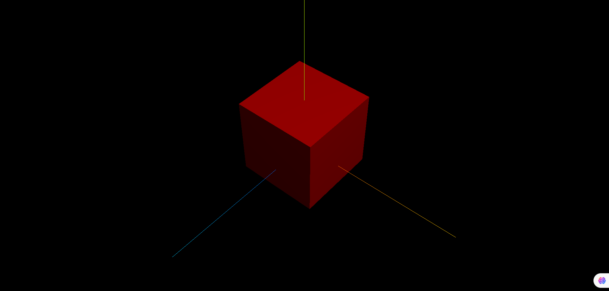

## 引入扩展库 OrbitControls.js

```js
// 引入轨道控制器扩展库OrbitControls.js
import { OrbitControls } from 'three/addons/controls/OrbitControls.js';
```

## 使用 OrbitControls

```js
// 设置相机控件轨道控制器OrbitControls
const controls = new OrbitControls(camera, renderer.domElement);
// 如果OrbitControls改变了相机参数,重新调用渲染器渲染三维场景
controls.addEventListener('change', function () {
  renderer.render(scene, camera); //执行渲染操作
}); //监听鼠标、键盘事件
```

## OrbitControls 本质

> OrbitControls 本质上就是改变相机的参数,比如相机的位置属性,改变相机位置也可以改变相机拍照场景中模型的角度,实现模型的 360 度旋转预览效果,改变透视投影相机距离模型的距离,就可以改变相机能看到的视野范围.

```js
controls.addEventListener('change', function () {
  // 浏览器控制台查看相机位置变化
  console.log('camera.position', camera.position);
});
```

## 完整代码

```js
import * as THREE from 'three';

// 引入轨道控制器扩展库OrbitControls.js
import { OrbitControls } from 'three/addons/controls/OrbitControls.js';

const scene = new THREE.Scene();

const geometry = new THREE.BoxGeometry(100, 100, 100);
const material = new THREE.MeshLambertMaterial({
  color: 0xff0000,
});
const mesh = new THREE.Mesh(geometry, material);
mesh.position.set(0, 20, 0);
scene.add(mesh);

const pointLight = new THREE.PointLight(0xffffff); //点光源:两个参数分别表示光源颜色和光照强度
pointLight.decay = 0.0; //设置光源不随距离衰减
pointLight.intensity = 1.0; //光照强度
pointLight.position.set(300, 700, 100); // 设置光源的位置的位置
scene.add(pointLight); // 将灯光添加到场景中

const camera = new THREE.PerspectiveCamera(
  30,
  window.innerWidth / window.innerHeight,
  0.1,
  1000
);
camera.position.set(300, 300, 300);
camera.lookAt(mesh.position);
scene.add(camera);

const axesHelper = new THREE.AxesHelper(200);
scene.add(axesHelper);

const renderer = new THREE.WebGLRenderer();
renderer.setSize(window.innerWidth, window.innerHeight);
renderer.render(scene, camera);
document.body.appendChild(renderer.domElement);

// 设置相机控件轨道控制器OrbitControls
const control = new OrbitControls(camera, renderer.domElement);
// 如果OrbitControls改变了相机参数,重新调用渲染器渲染三维场景
control.addEventListener('change', () => renderer.render(scene, camera)); //执行渲染操作
```

## 效果


