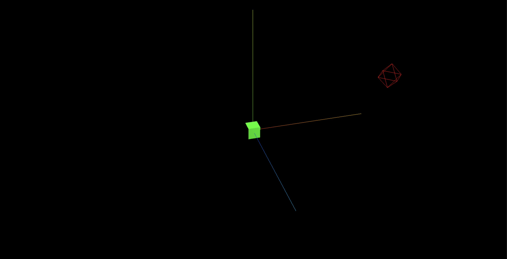
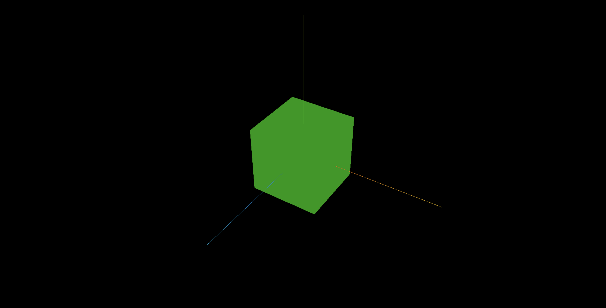
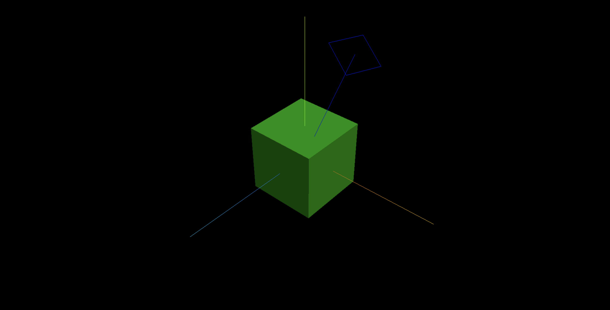

**本篇文章通过平行光和环境光进一步了解光照对模型 Mesh 表面的影响**


## 添加点光源辅助观察对象: PointLightHelper

> 通过点光源辅助对象 PointLightHelper 可以实现可视化点光源.

> 可以借助轨道控制器旋转缩放三维场景便于预览点光源的位置.

```js
// 添加点光源辅助观察对象
const pointLightHelper = new THREE.PointLightHelper(pointLight, 10, 0xff0000);
scene.add(pointLightHelper);
```

**效果**


## 添加环境光: AmbientLight

> 环境光 AmbientLight 没有特定方向,只是整体改变场景的明暗.

```js
// 添加环境光
const ambientLight = new THREE.AmbientLight(0xffffff, 1);
scene.add(ambientLight);
```

**效果**


## 添加平行光: DirectionalLight

> 平行光 DirectionalLight 就是沿着特定的方向发射.

```js
// 添加平行光
const directionalLight = new THREE.DirectionalLight(0xffffff, 1);
// 设置光源的方向：通过光源position属性和目标指向对象的position属性计算
directionalLight.position.set(50, 100, 20);
// 方向光指向对象网格模型mesh,可以不设置,默认的位置是0,0,0
directionalLight.target = mesh;
scene.add(directionalLight);
```

## 平行光辅助观察: DirectionalLightHelper

> 通过点光源辅助观察对象 DirectionalLightHelper (opens new window)可视化点光源.

```js
// 添加平行光辅助观察对象
const directionalLightHelper = new THREE.DirectionalLightHelper(
  directionalLight,
  10,
  0x0000ff
);
scene.add(directionalLightHelper);
```

**效果**


## 平行光与 Mesh 表面光线的反射规律

> 平行光照射到网格模型 Mesh 表面时,光线和模型表面会构成一个入射角度,入射角度不同,对光照的反射能力也不同.

> 光线照射到漫反射网格材质 MeshLambertMaterial 对应的 Mesh 表面时,Mesh 表面对光线的反射程度与入射角的大小有关.


```js
// 对比不同入射角，mesh表面对光照的反射效果
directionalLight.position.set(100, 0, 0);
directionalLight.position.set(0, 100, 0);
directionalLight.position.set(100, 100, 100);
directionalLight.position.set(100, 60, 50);
//directionalLight.target默认指向坐标原点
```
