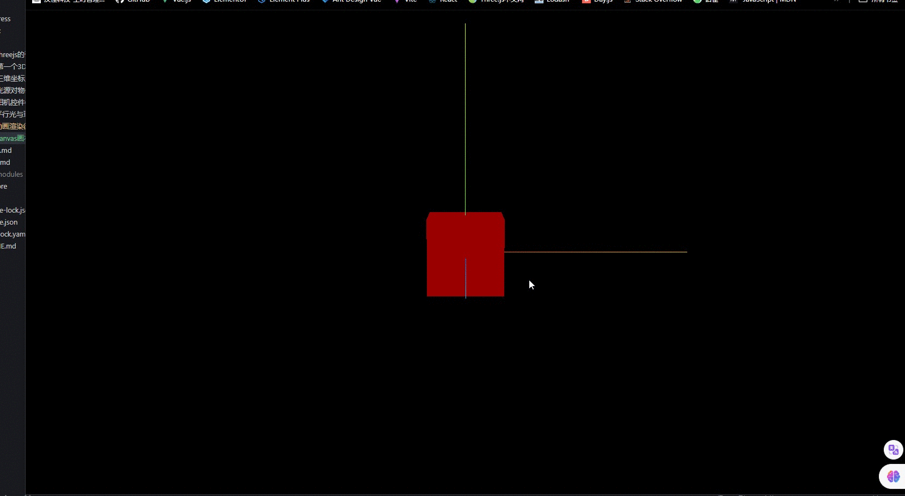

**threejs 渲染输出的就是一个 Canvas 画布,Canvas 画布也是 HTML 元素,这意味着 threejs 渲染结果的布局和普通的 HTML 元素是一样的.**

> 通过 renderer.domElement 属性可以访问 threejs 的渲染结果

## 全屏渲染画布

```js
// width和height用来设置Three.js输出的Canvas画布尺寸(像素px)
const width = window.innerWidth; //窗口文档显示区的宽度作为画布宽度
const height = window.innerHeight; //窗口文档显示区的高度作为画布高度
const renderer = new THREE.WebGLRenderer();
document.body.appendChild(renderer.domElement);
```

## canvas 画布宽高度动态变化

> canvas 画布宽高度动态变化,需要更新相机和渲染的参数,否则无法正常渲染.

```js
// onresize 事件会在窗口被调整大小时触发
window.onresize = function () {
  // 重置渲染器输出画布canvas尺寸
  renderer.setSize(window.innerWidth, window.innerHeight);
  // 全屏情况下: 设置观察范围长宽比aspect为窗口宽高比
  camera.aspect = window.innerWidth / window.innerHeight;
  // 渲染器执行render方法的时候会读取相机对象的投影矩阵属性projectionMatrix
  // 但是不会每渲染一帧，就通过相机的属性计算投影矩阵(节约计算资源)
  // 如果相机的一些属性发生了变化,需要执行updateProjectionMatrix ()方法更新相机的投影矩阵
  camera.updateProjectionMatrix();
};
```

## 完整代码

```js
import * as THREE from 'three';
import { OrbitControls } from 'three/addons/controls/OrbitControls.js';

const width = window.innerWidth;
const height = window.innerHeight;

const scene = new THREE.Scene();

const geometry = new THREE.BoxGeometry(50, 50, 50);
const material = new THREE.MeshLambertMaterial({
  color: 0xff0000,
});
const mesh = new THREE.Mesh(geometry, material);
scene.add(mesh);

const camera = new THREE.PerspectiveCamera(35, width / height, 0.1, 1000);
camera.position.set(300, 300, 300);
camera.lookAt(mesh.position);

const ambientLight = new THREE.AmbientLight(0xffffff, 1);
scene.add(ambientLight);

const axesHelper = new THREE.AxesHelper(150);
scene.add(axesHelper);

const renderer = new THREE.WebGLRenderer();
renderer.setSize(width, height);
renderer.render(scene, camera);

new OrbitControls(camera, renderer.domElement);

const render = () => {
  requestAnimationFrame(render);
  renderer.render(scene, camera);
};

render();

window.onresize = () => {
  renderer.setSize(window.innerWidth, window.innerHeight);
  camera.aspect = window.innerWidth / window.innerHeight;
  camera.updateProjectionMatrix();
};

document.body.appendChild(renderer.domElement);
```

## 效果


