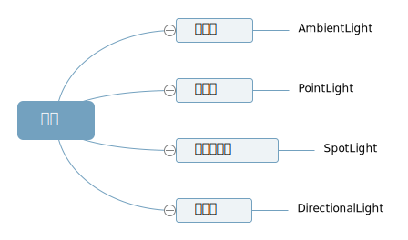
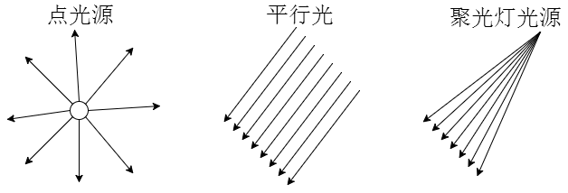

# 光源对物体表面的影响

> 实际生活中物体表面的明暗效果是会收到光照的影响,比如晚上不开灯就看不到物体,灯光比较暗,物体也比较暗.

> 在 threejs 中,可以使用网格模型(Mesh)来模拟生活中的物体,所以 threejs 中模拟光照(Light)对物体表面的影响,就是模拟光照(Light)对网格模型(Mesh)表面的影响.

## 受光照的材质

> threejs 提供的网格材质中,有的受光照影响,有的不受光照影响.


**基础网格材质不会受到光照的影响**

```js
const material = new THREE.MeshBasicMaterial();
```

**漫反射网格材质会受到光照的影响,该材质也可以称为 Lambert 网格材质**

> 一个立方体,长方体使用 MeshLambertMaterial 材质,不同面和光线夹角不同,立方体不同面就会呈现出来不同的明暗效果.

```js
const material = new THREE.MeshLambertMaterial();
```

## 光源种类有哪几种?



## 光源效果示意图



## 添加点光源

> 点光源 PointLight 可以类比为一个发光点,就像生活中一个灯泡以灯泡为中心向四周发射光线.

```js
// 点光源: 两个参数分别表示光源颜色和光照强度
const pointLight = new THREE.PointLight(0xffffff, 1.0);
```

> 除了通过 THREE.PointLight 的参数 2 设置光照强度,还可以通过.intensity 设置

```js
pointLight.intensity = 10.0;
```

## 设置光源衰减

> 实际生活中点光源,比如一个电灯泡,随着距离的改变,光线就会衰减,越来越弱,光线衰减属性.decay 默认值是 2.0,如果不希望衰减可以设置为 0.0

```js
pointLight.decay = 0.0; // 设置光源不随距离衰减
```

> tip: 如果使用默认衰减 2.0,不同版本可能有差异,对于部分 threejs 新版本,有时候你可能看不到光源效果,这时候可以把光照强度加强试试看,如果你的版本不影响,就不用加强光照强度(根据版本情况灵活对应).

## 设置光源的位置

> 可以将点光源想象为一个电灯泡, 你现在处于 3D 空间中,放的位置不同,模型的渲染效果就不一样.

> 注意光源的尺寸大小: 如果你希望光源照在模型的外表面,那么就需要把光源放在模型的外面.

```js
pointLight.position.set(400, 0, 0); // 将点光源放在x轴上
```

## 将光源添加到场景

> 光源和网格模型同样都是三维场景的一部分,自然需要添加到三维场景中才会起作用.

```js
scene.add(pointLight); //将点光源添加到场景中
```

## 完整代码

```js
import * as THREE from 'three';

const width = 800;
const height = 500;
const scene = new THREE.Scene();

const geometry = new THREE.BoxGeometry(100, 100, 100);
const material = new THREE.MeshLambertMaterial({
  color: 0xff0000,
});
const mesh = new THREE.Mesh(geometry, material);
mesh.position.set(0, 20, 0);
scene.add(mesh);

const pointLight = new THREE.PointLight(0xffffff); //点光源:两个参数分别表示光源颜色和光照强度
pointLight.decay = 0.0; //设置光源不随距离衰减
pointLight.intensity = 1.0; //光照强度
pointLight.position.set(300, 700, 100); // 设置光源的位置的位置
scene.add(pointLight); // 将灯光添加到场景中

const camera = new THREE.PerspectiveCamera(30, width / height, 0.1, 1000);
camera.position.set(300, 300, 300);
camera.lookAt(mesh.position);
scene.add(camera);

const axesHelper = new THREE.AxesHelper(200);
scene.add(axesHelper);

const renderer = new THREE.WebGLRenderer();
renderer.setSize(width, height);
renderer.render(scene, camera);
document.querySelector('.box').appendChild(renderer.domElement);
```

## 效果


