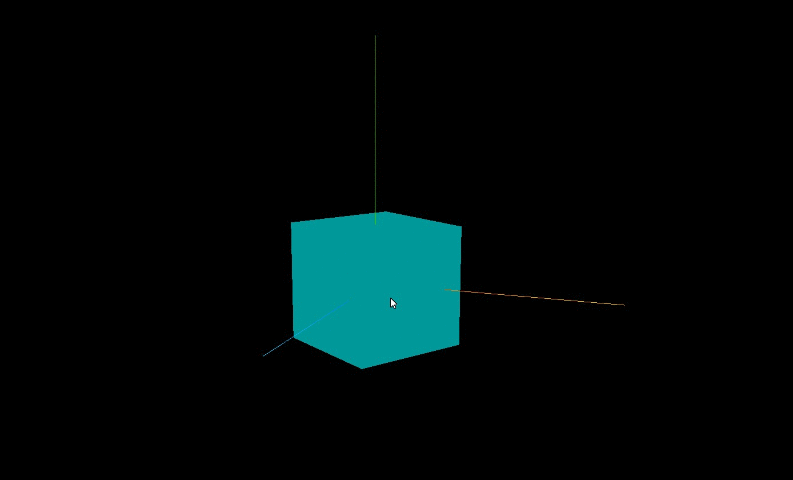
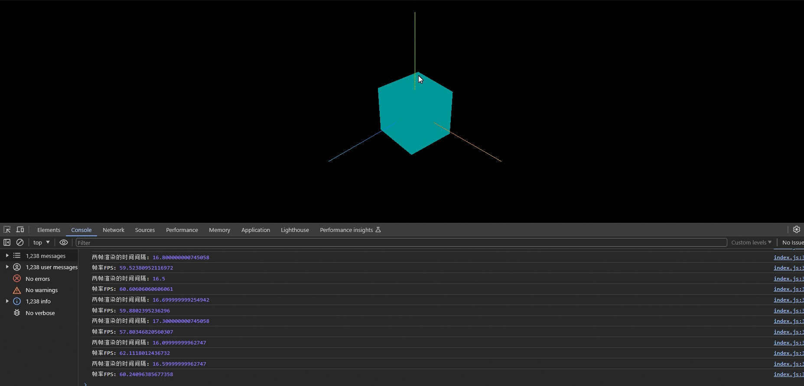

**threejs 可以借助 HTML5 的 API 请求动画帧 window.requestAnimationFrame 来实现动画渲染**

## 请求动画帧: window.requestAnimationFrame

> 借助 window.requestAnimationFrame 可以实现周期性的循环执行

> window.requestAnimationFrame 默认每秒钟执行 60 次,但不一定能做到,要看代码的性能

> 对于部分高刷新率的电脑硬件设备,.requestAnimationFrame 每秒钟默认调用函数执行次数也是有可能超过 60 次的,比如你的电脑显卡、显示器等硬件能够支持 144hz 刷新频率,requestAnimationFrame 的每秒执行上限,也可以接近 144 帧率.

```js
let i = 0;
const render = () => {
  i += i;
  requestAnimationFrame(render); //请求再次执行渲染函数render，渲染下一帧
  console.log('执行次数:', i);
};
```

## threejs 实现旋转动画

**效果**


> 动画说白了就是一张张图片,连起来依次展示,这样就会形成一个动画效果,只要帧率高,人的眼睛都不会感觉到卡顿,呈现的是连续的视频效果.

```js
const render = () => {
  mesh.rotateY(0.01); //每次绕y轴旋转0.01弧度
  requestAnimationFrame(render); //请求再次执行渲染函数render，渲染下一帧
  renderer.render(scene, camera); //执行渲染操作
};
```

## 计算两帧渲染时间的间隔和帧率

**效果**


```js
const clock = new THREE.Clock();
function render() {
  const spt = clock.getDelta() * 1000; //毫秒
  console.log('两帧渲染时间间隔(毫秒)', spt);
  console.log('帧率FPS', 1000 / spt);
  renderer.render(scene, camera); //执行渲染操作
  mesh.rotateY(0.01); //每次绕y轴旋转0.01弧度
  requestAnimationFrame(render); //请求再次执行渲染函数render，渲染下一帧
}
render();
```

## 渲染循环和轨道控制器

> 设置了渲染循环后,轨道控制器就不用再通过 change 事件执行 renderer.render(scene,camera)了,毕竟渲染循环一直在不停的执行着.

## 完整代码

```js
import * as THREE from 'three';
import { OrbitControls } from 'three/addons/controls/OrbitControls.js';

const scene = new THREE.Scene();

const geometry = new THREE.BoxGeometry(50, 50, 50);
const material = new THREE.MeshLambertMaterial({
  color: 0x00ffff,
});

const mesh = new THREE.Mesh(geometry, material);
scene.add(mesh);

const camera = new THREE.PerspectiveCamera(
  35,
  window.innerWidth / window.innerHeight,
  0.1,
  1000
);
camera.position.set(200, 200, 200);
camera.lookAt(mesh.position);

const pointLight = new THREE.AmbientLight(0xffffff, 1);
scene.add(pointLight);

const axesHelper = new THREE.AxesHelper(100);
scene.add(axesHelper);

const renderer = new THREE.WebGLRenderer();
renderer.setSize(window.innerWidth, window.innerHeight);

new OrbitControls(camera, renderer.domElement);

const clock = new THREE.Clock();

const render = () => {
  const spt = clock.getDelta() * 1000; // 毫秒
  console.log('两帧渲染的时间间隔:', spt);
  console.log('帧率FPS:', 1000 / spt);
  mesh.rotateY(0.01); //每次绕y轴旋转0.01弧度
  requestAnimationFrame(render); //请求再次执行渲染函数render，渲染下一帧
  renderer.render(scene, camera); //执行渲染操作
};

render();

document.body.appendChild(renderer.domElement);
```
