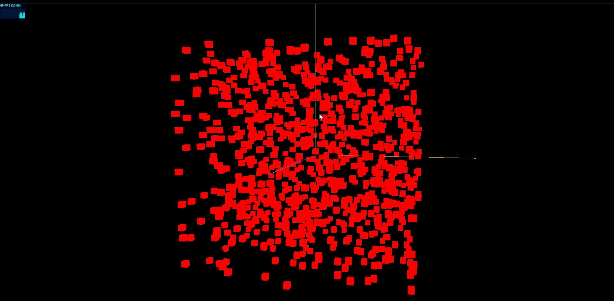

**threejs 每执行 WebGL 渲染器的.render()方法一次,就会在 canvas 画布上得到一帧图像,不停地周期性执行.render()方法就可以更新 cavans 画布上的内容,一般场景越复杂往往渲染性能月底,也就是每秒钟执行.render()方法的次数越少**

**通过 stats.js 库可以查看 threejs 当前的渲染性能,具体说就是计算 threejs 的渲染帧率(FPS),所谓的渲染帧率(FPS)简单说就是 threejs 每秒钟完成的渲染次数,一般渲染达到每秒钟 60 次为最佳状态**

## Stats.js 的使用

```js
//引入性能监视器stats.js
import Stats from 'three/addons/libs/stats.module.js';

//创建stats对象
const stats = new Stats();
//stats.domElement:web页面上输出计算结果,一个div元素，
document.body.appendChild(stats.domElement);
// 渲染函数
function render() {
  //requestAnimationFrame循环调用的函数中调用方法update(),来刷新时间
  stats.update();
  renderer.render(scene, camera); //执行渲染操作
  requestAnimationFrame(render); //请求再次执行渲染函数render，渲染下一帧
}
render();
```

## stats 方法 setMode(mode)

> 可以通过 setMode()方法的参数 mode 的数值设置首次打开页面,测试结果的显示模式,鼠标单击可以更换不同的显示模式.

```js
// 设置stats.domElement模式
stats.setMode(0); // 渲染帧率,刷新频率,一秒渲染次数
// stats.setMode(1); // 渲染周期,渲染一帧多长时间(单位：毫秒ms)
```

## 性能测试

> 控制长方体模型数量,你可以逐渐增加或减少,看看帧率变化,电脑性能不同结果不同.

```js
// 性能测试, 创建1000个物体
for (let i = 0; i < 1000; i++) {
  const geometry = new THREE.BoxGeometry(5, 5, 5);
  const material = new THREE.MeshBasicMaterial({
    color: 0xff0000,
  });
  const mesh = new THREE.Mesh(geometry, material);
  const x = (Math.random() - 0.5) * 200;
  const y = (Math.random() - 0.5) * 200;
  const z = (Math.random() - 0.5) * 200;
  mesh.position.set(x, y, z);
  scene.add(mesh);
}
```

## 完整代码

```js
import * as THREE from 'three';
import { OrbitControls } from 'three/addons/controls/OrbitControls.js';

//引入性能监视器stats.js
import Stats from 'three/addons/libs/stats.module.js';

const width = window.innerWidth;
const height = window.innerHeight;

const scene = new THREE.Scene();

// 性能测试, 创建1000个物体
for (let i = 0; i < 1000; i++) {
  const geometry = new THREE.BoxGeometry(5, 5, 5);
  const material = new THREE.MeshBasicMaterial({
    color: 0xff0000,
  });
  const mesh = new THREE.Mesh(geometry, material);
  const x = (Math.random() - 0.5) * 200;
  const y = (Math.random() - 0.5) * 200;
  const z = (Math.random() - 0.5) * 200;
  mesh.position.set(x, y, z);
  scene.add(mesh);
}

const axesHelper = new THREE.AxesHelper(150);
scene.add(axesHelper);

const camera = new THREE.PerspectiveCamera(35, width / height, 1, 3000);
camera.position.set(200, 200, 200);
camera.lookAt(0, 0, 0);

const renderer = new THREE.WebGLRenderer();
renderer.setSize(width, height);

//创建stats对象
const stats = new Stats();

// 设置stats.domElement模式
stats.setMode(0); // 渲染帧率,刷新频率,一秒渲染次数
// stats.setMode(1); // 渲染周期,渲染一帧多长时间(单位：毫秒ms)

// stats.domElement: web页面上输出计算结果,是一个div元素
document.body.appendChild(stats.domElement);

const render = () => {
  //requestAnimationFrame循环调用的函数中调用方法update(),来刷新时间
  stats.update();
  renderer.render(scene, camera);
  window.requestAnimationFrame(render);
};

render();

new OrbitControls(camera, renderer.domElement);

document.body.appendChild(renderer.domElement);

window.onresize = () => {
  renderer.setSize(window.innerWidth, window.innerHeight);
  camera.aspect = window.innerWidth / window.innerHeight;
  camera.updateProjectionMatrix();
};
```

## 效果


