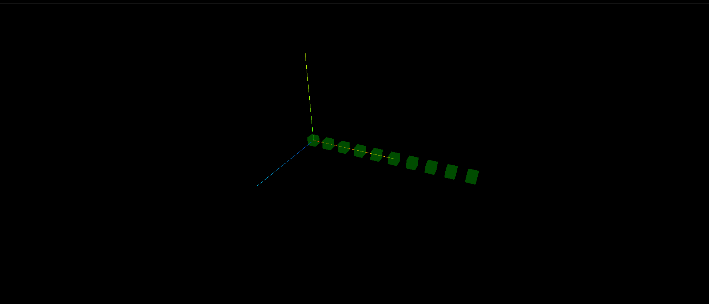
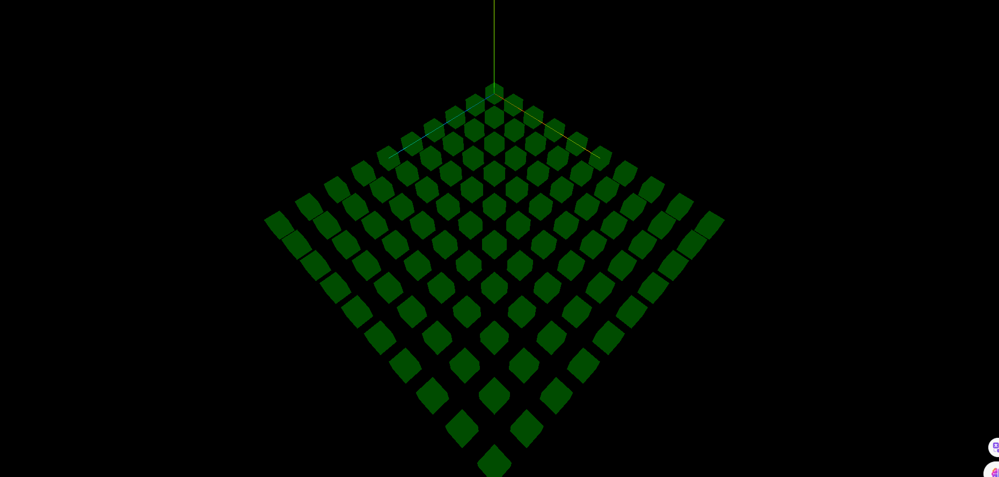
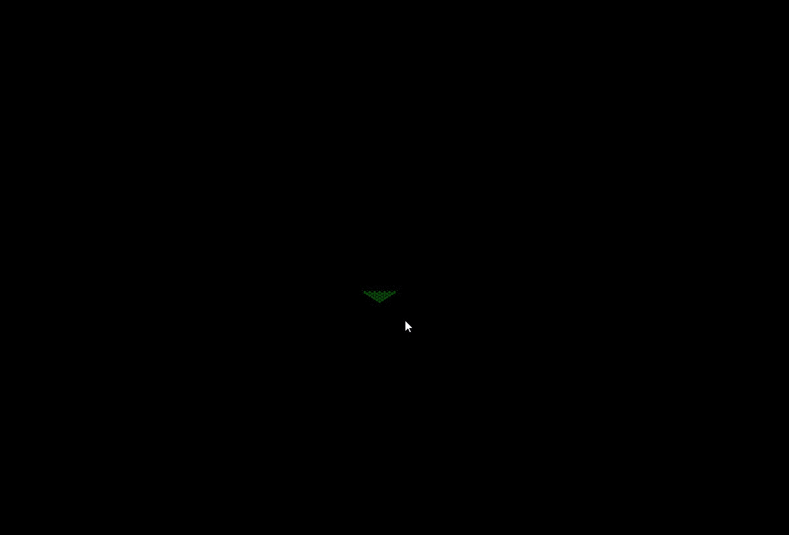

## 使用 for 循环创建一列模型

```js
const geometry = new THREE.BoxGeometry(100, 100, 100);
//材质对象Material
const material = new THREE.MeshLambertMaterial({
  color: 0x00ffff, //设置材质颜色
  transparent: true, //开启透明
  opacity: 0.5, //设置透明度
});
for (let i = 0; i < 10; i++) {
  const mesh = new THREE.Mesh(geometry, material); //网格模型对象Mesh
  // 沿着x轴分布
  mesh.position.set(i * 200, 0, 0);
  scene.add(mesh); //网格模型添加到场景中
}
```



## 双层 for 循环创建阵列模型

```js
const geometry = new THREE.BoxGeometry(10, 10, 10);
const material = new THREE.MeshLambertMaterial({
  color: 0x00ff00,
  transparent: true,
  opacity: 0.5,
});

for (let i = 0; i < 10; i++) {
  for (let j = 0; j < 10; j++) {
    const mesh = new THREE.Mesh(geometry, material);
    // 在XOZ平面上分布
    mesh.position.set(i * 20, 0, j * 20);
    scene.add(mesh);
  }
}
```



## 相机位置拉远,可以得到更大的观察范围

```js
const camera = new THREE.PerspectiveCamera(60, width / height, 1, 3000);
// camera.position.set(100, 130, 115);

// 在原来相机位置基础上拉远,可以观察到更大的范围
camera.position.set(200, 200, 200);
camera.lookAt(0, 0, 0);
```

## 超出视椎体远载界面的范围会被裁剪掉

```js
const camera = new THREE.PerspectiveCamera(60, width / height, 1, 3000);
// 超出视锥体远裁界面的范围的会被剪裁掉,不会被渲染,可以调整far参数适配
camera.position.set(1900, 1900, 1900);
camera.lookAt(0, 0, 0);
```



## 改变相机观察目标

```js
const camera = new THREE.PerspectiveCamera(60, width / height, 1, 3000);
camera.position.set(1900, 1900, 1900);

// 改变相机观察目标点
camera.lookAt(100, 0, 100);
```

> 注意相机控件 OrbitControls 会影响 lookAt 设置,注意手动设置 OrbitControls 的目标参数

```js
// 设置相机控件轨道控制器OrbitControls
const controls = new OrbitControls(camera, renderer.domElement);
// 相机控件.target属性在OrbitControls.js内部表示相机目标观察点, 默认0,0,0
controls.target.set(1000, 0, 1000);
controls.update(); //update()函数内会执行camera.lookAt(controls.targe)
```

## 远小近大投影规律

> 透视投影相机的投影规律是远小近大,通过相机观察阵列立方体大小变化,可以看到距离相机越远,立方体的渲染视觉效果越小.

## fov 改变

> 增加相机视角 fov,视锥体范围更大,意味着可以看到渲染范围更大,远小近大的视觉效果更明显.


## 完整代码

```js
import * as THREE from 'three';
import { OrbitControls } from 'three/addons/controls/OrbitControls.js';

const width = window.innerWidth;
const height = window.innerHeight;

const scene = new THREE.Scene();

const geometry = new THREE.BoxGeometry(10, 10, 10);
const material = new THREE.MeshLambertMaterial({
  color: 0x00ff00,
  transparent: true,
  opacity: 0.5,
});

for (let i = 0; i < 10; i++) {
  for (let j = 0; j < 10; j++) {
    const mesh = new THREE.Mesh(geometry, material);
    mesh.position.set(i * 20, 0, j * 20);
    scene.add(mesh);
  }
}

const ambientLight = new THREE.AmbientLight(0xffffff, 1);
scene.add(ambientLight);

const renderer = new THREE.WebGLRenderer();
renderer.setSize(width, height);

const camera = new THREE.PerspectiveCamera(60, width / height, 1, 3000);
camera.position.set(200, 200, 200);
camera.lookAt(100, 0, 100);

const render = () => {
  renderer.render(scene, camera);
  requestAnimationFrame(render);
};

render();

const controls = new OrbitControls(camera, renderer.domElement);
controls.target.set(100, 0, 100);
controls.update();

const axesHelper = new THREE.AxesHelper(100);
scene.add(axesHelper);

document.body.appendChild(renderer.domElement);

window.onresize = () => {
  renderer.setSize(window.innerWidth, window.innerHeight);
  camera.aspect = window.innerWidth / window.innerHeight;
  camera.updateProjectionMatrix();
};
```
