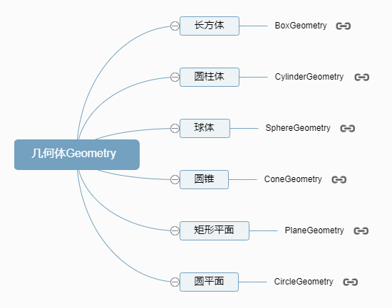
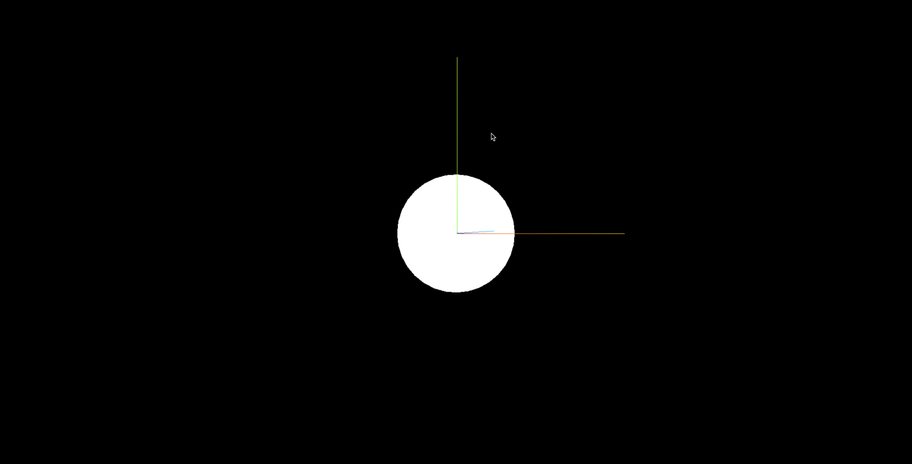

**几何体 Geometry**


```js
//BoxGeometry：长方体
const geometry = new THREE.BoxGeometry(100, 100, 100);
// SphereGeometry：球体
const geometry = new THREE.SphereGeometry(50);
// CylinderGeometry：圆柱
const geometry = new THREE.CylinderGeometry(50, 50, 100);
// PlaneGeometry：矩形平面
const geometry = new THREE.PlaneGeometry(100, 50);
// CircleGeometry：圆形平面
const geometry = new THREE.CircleGeometry(50);
```

## 双面可见

> threejs 中的材质默认只有正面可见,反面不可见,对于矩形平面和圆形平面来说,如果你想看到两面,需要手动设置 side: THREE.DoubleSide
> 

## 完整代码

```js
import * as THREE from 'three';
import { OrbitControls } from 'three/addons/controls/OrbitControls.js';

const width = window.innerWidth;
const height = window.innerHeight;

const scene = new THREE.Scene();

// BoxGeometry: 长方体
// const geometry = new THREE.BoxGeometry(50, 50, 50);

// SphereGeometry: 球体
// const geometry = new THREE.SphereGeometry(50);

// CylinderGeometry: 圆柱
// const geometry = new THREE.CylinderGeometry(50, 50, 100);

// PlaneGeometry: 矩形平面
// const geometry = new THREE.PlaneGeometry(100, 50);

// CircleGeometry：圆形平面
const geometry = new THREE.CircleGeometry(50);
const material = new THREE.MeshBasicMaterial({
  // side: THREE.FrontSide, //默认只有正面可见
  side: THREE.DoubleSide, // 设置为双面可见
});
const mesh = new THREE.Mesh(geometry, material);
scene.add(mesh);

const camera = new THREE.PerspectiveCamera(60, width / height, 1, 1000);
camera.position.set(200, 200, 200);
camera.lookAt(mesh.position);

const renderer = new THREE.WebGLRenderer();
renderer.setSize(width, height);

const axesHelper = new THREE.AxesHelper(150);
scene.add(axesHelper);

const controls = new OrbitControls(camera, renderer.domElement);

const render = () => {
  renderer.render(scene, camera);
  window.requestAnimationFrame(render);
};

render();

document.body.appendChild(renderer.domElement);
```
