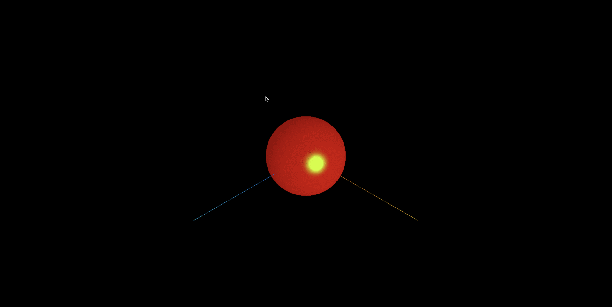

**高光网格材质 MeshPhongMaterial 和基础网格材质 MeshBasicMaterial,漫反射网格材质 MeshLambertMaterial 同样都是网格模型 Mesh 的材质.**

**高光网格材质 MeshPhongMaterial 和漫反射网格材质 MeshLambertMaterial 一样会受到光照的影响.**


## MeshPhongMaterial 对光照反射的特点

> MeshPhongMaterial 和 MeshLambertMaterial 都会受到光照的影响,区别在于对光线的反射方式有差异.

> MeshPhongMaterial 可以实现 MeshLambertMaterial 不能实现的高光反射效果.

> 对于高光效果,可以想象一下,在太阳下面观察一辆车,会发现在特定的角度和位置,车表面的某个区域非常高亮.

## 镜面反射与漫反射的区别

> MeshPhongMaterial 可以提供一个镜面反射效果,比如在生活拿着一面镜子,放在了太阳光底下,调整角度就可以把太阳光反射到其他地方,如果反射光对着眼睛,也就是反射光线和视线平行的时候,会感觉到非常刺眼.

> MeshLambertMaterial 对应的 Mesh 只是受到光线照射,不会产生镜面反射的效果,它只是一个漫反射,也就是光线向四周反射.


## 高光亮度属性.shininess

> 通过 MeshPhongMaterial 的高光亮度,设置.shininess 属性可以控制高光的反射效果.

```js
// 模拟镜面反射，产生一个高光效果
const material = new THREE.MeshPhongMaterial({
  color: 0xff0000,
  shininess: 20, // 高光部分的亮度，默认30
});
```

## 高光颜色属性.specular

> 设置高光的颜色

```js
// 模拟镜面反射，产生一个高光效果
const material = new THREE.MeshPhongMaterial({
  color: 0xff0000,
  shininess: 20, // 高光部分的亮度，默认30
  specular: 0x444444, // 高光部分的颜色
});
```

## 完整代码

```js
import * as THREE from 'three';
import { OrbitControls } from 'three/addons/controls/OrbitControls.js';

const width = window.innerWidth;
const height = window.innerHeight;

const scene = new THREE.Scene();

const geometry = new THREE.SphereGeometry(50, 50, 50);
const material = new THREE.MeshPhongMaterial({
  color: 0xff0000,
  shininess: 80, // 高光部分的亮度,默认30
  specular: 0xffffff, // 高光部分的颜色
});

const mesh = new THREE.Mesh(geometry, material);
scene.add(mesh);

const camera = new THREE.PerspectiveCamera(60, width / height, 1, 1000);
camera.position.set(200, 200, 200);
camera.lookAt(mesh.position);

const ambientLight = new THREE.AmbientLight(0xffffff, 1);
scene.add(ambientLight);

const directionalLight = new THREE.DirectionalLight(0xffffff, 1);

directionalLight.position.set(100, 20, 30);
// 方向光指向对象网格模型mesh,可以不设置,默认的位置是0,0,0
directionalLight.target = mesh;
scene.add(directionalLight);

const renderer = new THREE.WebGLRenderer();
renderer.setSize(width, height);

const axesHelper = new THREE.AxesHelper(150);
scene.add(axesHelper);

const controls = new OrbitControls(camera, renderer.domElement);

const render = () => {
  renderer.render(scene, camera);
  window.requestAnimationFrame(render);
};

render();

document.body.appendChild(renderer.domElement);
```

## 效果


