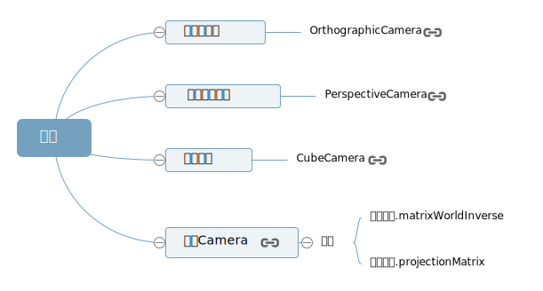
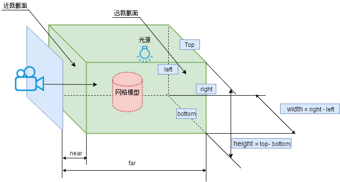

## 正投影相机



## 正投影长方体可视空间

> 正投影相机的长方体可视化空间和透视投影视椎体类似,只是形状不同



**正投影相机**

```js
// 构造函数格式
OrthographicCamera(left, right, top, bottom, near, far);
```

| 参数   | 含义                                                                               | 默认值 |
| ------ | ---------------------------------------------------------------------------------- | ------ |
| left   | 渲染空间的左边界                                                                   |        |
| right  | 渲染空间的右边界                                                                   |        |
| top    | 渲染空间的上边界                                                                   |        |
| bottom | 渲染空间的下边界                                                                   |        |
| near   | near 属性表示的是从距离相机多远的位置开始渲染，一般情况会设置一个很小的值          | 0.1    |
| far    | far 属性表示的是距离相机多远的位置截止渲染，如果设置的值偏小小，会有部分场景看不到 | 2000   |

## 渲染范围设置

> 设置正投影相机长方体可视化空间的渲染范围

```js
// 正投影相机
const width = window.innerWidth; // canvas画布宽度
const height = window.innerHeight; // canvas画布高度
const k = width / height; // canvas画布宽高比
const s = 600; // 控制left, right, top, bottom范围大小
const camera = new THREE.OrthographicCamera(-s * k, s * k, s, -s, 1, 7000);
```

## 相机位置和观察目标设置

> 相当于相机放在 y 轴上,向下观察地面上阵列的长方体

```js
camera.position.set(0, 2000, 0); // 相机放在了y轴上
camera.lookAt(0, 0, 0); // 指向坐标原点
```

> 注意.position 位置和 far 参数的设置,确保你想看到的物体能够包含在 far 之内,超出 far 的不会渲染

> 测试：far 减小,物体不在可视化空间之内,则看不到

```js
new THREE.OrthographicCamera(-s * k, s * k, s, -s, 1, 500);
```

> 测试：.position.y 增大,物体不在可视化空间之内,也看不到

```js
camera.position.set(0, 10000, 0);
```
