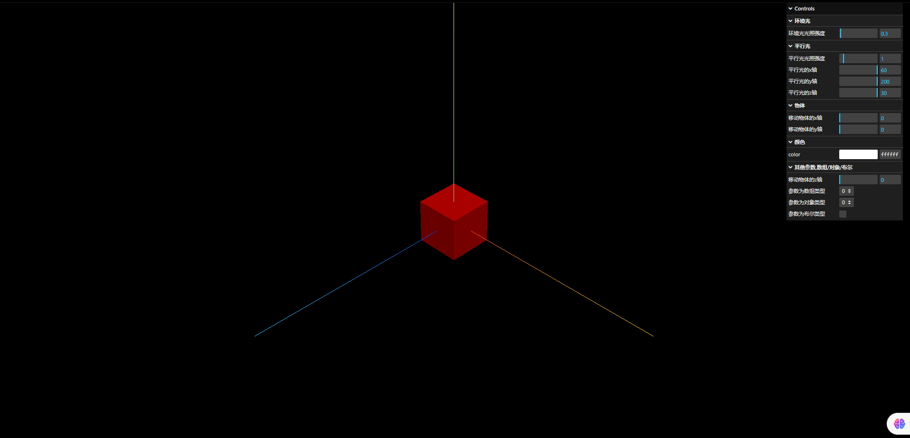

## 完整代码

```js
import * as THREE from 'three';
import { OrbitControls } from 'three/addons/controls/OrbitControls.js';
import { GUI } from 'three/addons/libs/lil-gui.module.min.js';

const width = window.innerWidth;
const height = window.innerHeight;

const scene = new THREE.Scene();

const geometry = new THREE.BoxGeometry(20, 20, 20);
const material = new THREE.MeshLambertMaterial({ color: 0xff0000 });
const mesh = new THREE.Mesh(geometry, material);
scene.add(mesh);

const camera = new THREE.PerspectiveCamera(30, width / height, 0.1, 1000);
camera.position.set(200, 200, 200);
camera.lookAt(mesh.position);

const directionalLight = new THREE.DirectionalLight(0xffffff, 1);
directionalLight.position.set(60, 200, 30);
scene.add(directionalLight);

const ambientLight = new THREE.AmbientLight(0xffffff, 0.3);
scene.add(ambientLight);

const renderer = new THREE.WebGLRenderer();
renderer.setSize(width, height);

const axesHelper = new THREE.AxesHelper(100);
scene.add(axesHelper);

new OrbitControls(camera, renderer.domElement);

const gui = new GUI();

const ambientLightFodler = gui.addFolder('环境光');
ambientLightFodler
  .add(ambientLight, 'intensity', 0, 10)
  .step(0.01)
  .name('环境光光照强度');
ambientLightFodler.close();

const directionalLightFolder = gui.addFolder('平行光');
directionalLightFolder.close();
directionalLightFolder
  .add(directionalLight, 'intensity', 0, 10)
  .step(0.01)
  .name('平行光光照强度');
directionalLightFolder
  .add(directionalLight.position, 'x', 0, 10)
  .name('平行光的x轴');
directionalLightFolder
  .add(directionalLight.position, 'y', 0, 10)
  .step(0.01)
  .name('平行光的y轴');
directionalLightFolder
  .add(directionalLight.position, 'z', 0, 10)
  .step(0.01)
  .name('平行光的z轴');

const meshFolder = gui.addFolder('物体');
meshFolder.close();
meshFolder.add(mesh.position, 'x', 0, 150).name('移动物体的x轴');
meshFolder.add(mesh.position, 'y', 0, 150).name('移动物体的y轴');

const obj = {
  color: 0xffffff,
  array: [100, 0, 10],
  obj2: {
    x: 10,
    y: 100,
    z: 200,
  },
  isRotate: false,
};

const colorFolder = gui.addFolder('颜色');
colorFolder.close();
colorFolder.addColor(obj, 'color').onChange((value) => {
  console.log(value);
  mesh.material.color.set(value);
});

const testFolder = gui.addFolder('其他参数,数组/对象/布尔');
testFolder.close();
testFolder
  .add(mesh.position, 'z', 0, 150)
  .step(0.01)
  .name('移动物体的z轴')
  .onChange((value) => {
    console.log(value);
  });

testFolder.add(mesh.position, 'x', obj.array).name('参数为数组类型');
testFolder.add(mesh.position, 'x', obj.obj2).name('参数为对象类型');
testFolder.add(obj, 'isRotate').name('参数为布尔类型');

const render = () => {
  if (obj.isRotate) {
    mesh.rotateY(0.01);
  }
  renderer.render(scene, camera);
  window.requestAnimationFrame(render);
};

render();

document.body.appendChild(renderer.domElement);

window.onresize = () => {
  renderer.setSize(window.innerWidth, window.innerHeight);
  camera.aspect = window.innerWidth / window.innerHeight;
  camera.updateProjectionMatrix();
};
```
