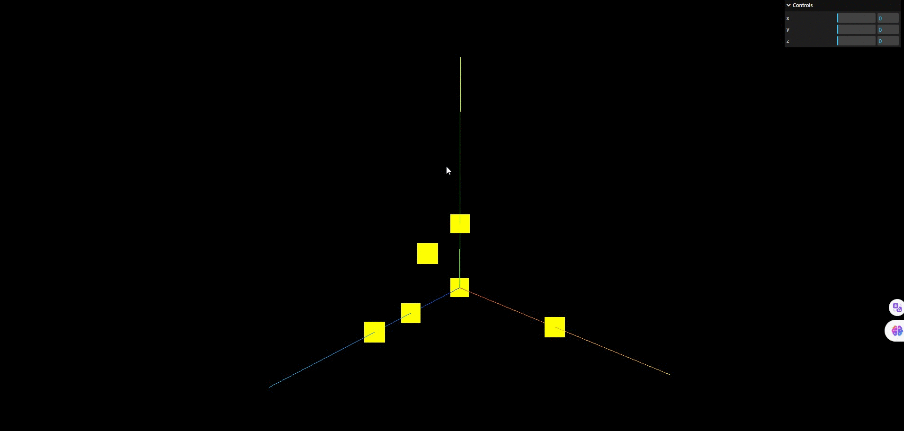

## 缓冲类型几何体: BufferGeometry

> threejs 中的长方体 BoxGeometry,球体 SphereGeometry 等几何体都是基于 BufferGeometry 这个类所构建的.

> BufferGeometry 是一个没有任何形状的空几何体,你可以通过 BufferGeometry 自定义任何几何形状,具体一点说就是定义顶点的数据.

```js
// 创建一个空的几何体对象
const geometry = new THREE.BufferGeometry();
```

## 定义几何体的顶点数据:BufferAttribute

> 通过 JavaScript 类型化数组 Float32Array 创建一组 xyz 坐标数据,用来表示所创建几何体的顶点坐标.

```js
const vertices = new Float32Array([
  0,
  0,
  0, //顶点1坐标
  50,
  0,
  0, //顶点2坐标
  0,
  100,
  0, //顶点3坐标
  0,
  0,
  10, //顶点4坐标
  0,
  0,
  100, //顶点5坐标
  50,
  0,
  10, //顶点6坐标
]);
```

> 通过 threejs 的属性缓冲区对象: BufferAttribute 来表示所创建几何体的顶点数据.

```js
// 创建属性缓冲区对象
// 3个为一组,表示一个顶点的xyz坐标
const attribute = new THREE.BufferAttribute(vertices, 3);
```

## 设置几何体顶点: geometry.attributes.position

> 通过 geometry.attributes.position 来设置所创建几何体顶点位置属性的值(BufferAttribute)

```js
// 设置几何体attributes属性位置的属性
geometry.attributes.position = attribute;
```

## 点模型

> 点模型 Points 和网格模型 Mesh 一样,都是 threejs 的一种模型对象,只是大部分情况下都会使用 Mesh 表示物体.

> 网格模型 Mesh 有自己对应的网格材质,点模型 Points 也有自己对应的网格材质 PointsMaterial

```js
// 点材质
const material = new THREE.PointsMaterial({
  color: 0xffff00,
  size: 10.0, // 设置点的大小
});
```

> 几何体 geometry 作为点模型 Points 参数,会将几何体渲染为点,把几何体作为 Mesh 的参数会将几何体渲染为面.

```js
const points = new THREE.Points(geometry, material); // 点模型对象
```

## 完整代码

**model.js**

```js
import * as THREE from 'three';

// 创建一个空的几何对象
const geometry = new THREE.BufferGeometry();

// 定义类型化数组用于创建顶点
const vertices = new Float32Array([
  0,
  0,
  0, //顶点1坐标
  50,
  0,
  0, //顶点2坐标
  0,
  30,
  0, //顶点3坐标
  0,
  0,
  30, //顶点4坐标
  0,
  0,
  50, //顶点5坐标
  10,
  30,
  30, //顶点6坐标
]);

// 创建属性缓冲区对象
const attribue = new THREE.BufferAttribute(vertices, 3); // 3个为一组,表示一个顶点的xyz坐标

// 设置几何顶点
geometry.attributes.position = attribue;

// 点渲染模式
const material = new THREE.PointsMaterial({ color: 0xffff00 });
material.size = 30;

const points = new THREE.Points(geometry, material);

export default points;
```

**index.js**

```js
import * as THREE from 'three';
import { OrbitControls } from 'three/addons/controls/OrbitControls.js';
import PointsModel from './model.js';
import { GUI } from 'three/addons/libs/lil-gui.module.min.js';

const width = window.innerWidth;
const height = window.innerHeight;

const scene = new THREE.Scene();
scene.add(PointsModel);

const camera = new THREE.PerspectiveCamera(30, width / height, 0.1, 1000);
camera.position.set(200, 200, 200);

const renderer = new THREE.WebGLRenderer();
renderer.setSize(width, height);

const render = () => {
  renderer.render(scene, camera);
  window.requestAnimationFrame(render);
};

render();

const axesHelper = new THREE.AxesHelper(100);
scene.add(axesHelper);

new OrbitControls(camera, renderer.domElement);

const gui = new GUI();
gui.add(PointsModel.position, 'x', 0, 100);
gui.add(PointsModel.position, 'y', 0, 100);
gui.add(PointsModel.position, 'z', 0, 100);
console.log(PointsModel);
document.body.appendChild(renderer.domElement);

window.onresize = () => {
  renderer.setSize(window.innerWidth, window.innerHeight);
  camera.aspect = window.innerWidth / window.innerHeight;
  camera.updateProjectionMatrix();
};
```

## 效果


