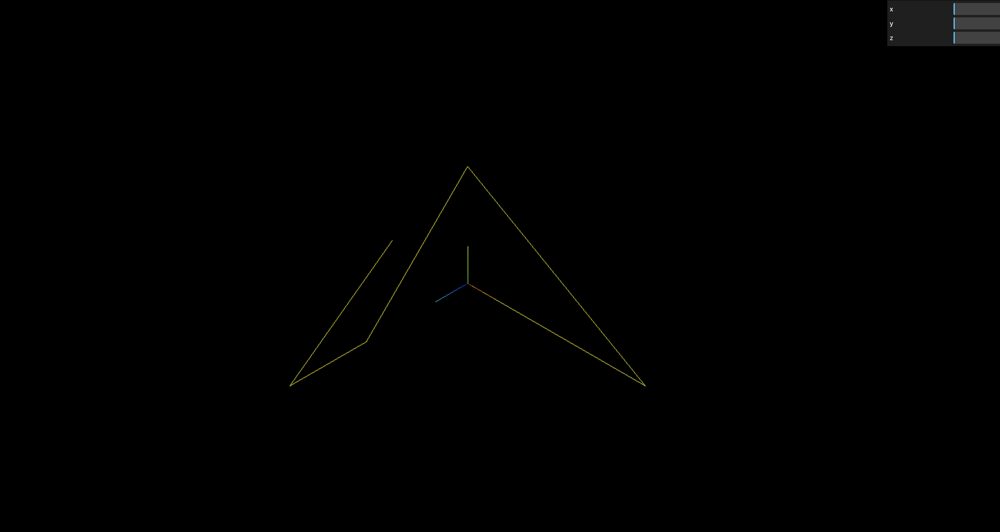
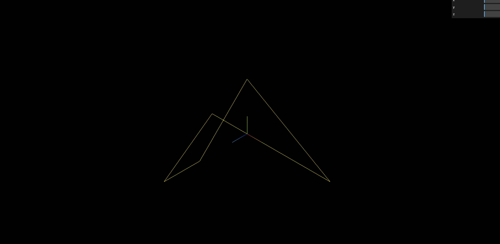
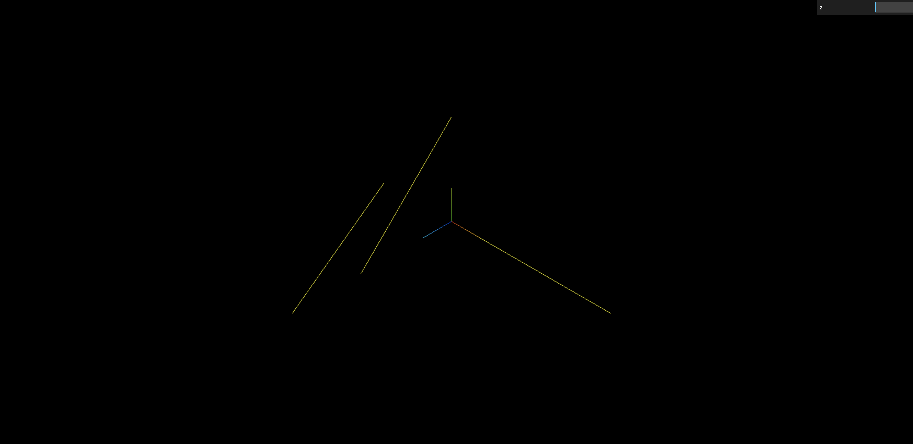

## 线模型 Line 渲染顶点数据

> 下面代码是把几何体作为线模型 Line (opens new window)的参数,你会发现渲染效果是从第一个点开始到最后一个点,依次连成线.

```js
// 线材质对象
const material = new THREE.LineBasicMaterial({
  color: 0xff0000, //线条颜色
});
// 创建线模型对象
const line = new THREE.Line(geometry, material);
```



## 线模型 LineLoop、LineSegments

> threejs 线模型除了 Line,还提供了 LineLoop (opens new window)、LineSegments (opens new window),区别在于绘制线条的规则不同.

```js
// 闭合线条
const line = new THREE.LineLoop(geometry, material);
```



```js
//非连续的线条
const line = new THREE.LineSegments(geometry, material);
```


