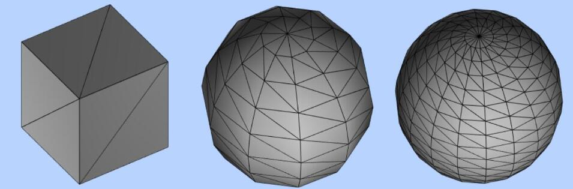

## 三角形(面)

> 网格模型 Mesh 其实就一个一个三角形(面)拼接构成,使用网格模型 Mesh 渲染几何体 geometry，就是几何体所有顶点坐标三个为一组,构成一个三角形,多组顶点构成多个三角形,就可以用来模拟表示物体的表面.



## 网格模型三角形：正反面

- 正面：逆时针
- 反面：顺时针

> 空间中一个三角形有正反两面,那么 Three.js 的规则是如何区分正反面的？非常简单，你的眼睛(相机)对着三角形的一个面,如果三个顶点的顺序是逆时针方向,该面视为正面,如果三个顶点的顺序是顺时针方向,该面视为反面.

## 双面可见

> Three.js 的材质默认正面可见,反面不可见.

```js
const material = new THREE.MeshBasicMaterial({
  color: 0x0000ff, //材质颜色
  side: THREE.FrontSide, //默认只有正面可见
});
```

```js
const material = new THREE.MeshBasicMaterial({
  side: THREE.DoubleSide, //两面可见
});
```

```js
const material = new THREE.MeshBasicMaterial({
  side: THREE.BackSide, //设置只有背面可见
});
```
