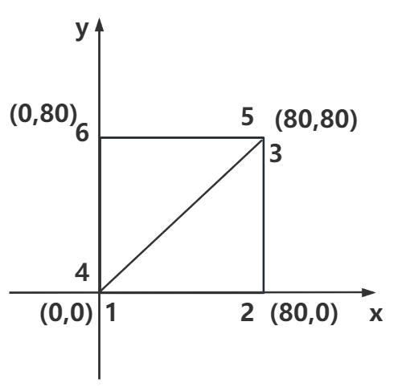

## 定义矩形几何体顶点坐标

> 一个矩形平面,可以至少通过两个三角形拼接而成,而且两个三角形有两个顶点的坐标是重合的.

> 注意三角形的正反面问题：保证矩形平面两个三角形的正面是一样的,也就是从一个方向观察,两个三角形都是逆时针或顺时针.



```js
const vertices = new Float32Array([
  0,
  0,
  0, //顶点1坐标
  80,
  0,
  0, //顶点2坐标
  80,
  80,
  0, //顶点3坐标

  0,
  0,
  0, //顶点4坐标   和顶点1位置相同
  80,
  80,
  0, //顶点5坐标  和顶点3位置相同
  0,
  80,
  0, //顶点6坐标
]);
```

## 完整代码

> model.js

```js
import * as THREE from 'three';

// 创建一个空的几何对象
const geometry = new THREE.BufferGeometry();

// 定义类型化数组用于创建顶点
const vertices = new Float32Array([
  0,
  0,
  0, //顶点1坐标
  80,
  0,
  0, //顶点2坐标
  80,
  80,
  0, //顶点3坐标

  0,
  0,
  0, //顶点4坐标   和顶点1位置相同
  80,
  80,
  0, //顶点5坐标  和顶点3位置相同
  0,
  80,
  0, //顶点6坐标
]);

// 创建属性缓冲区对象
const attribue = new THREE.BufferAttribute(vertices, 3); // 3个为一组,表示一个顶点的xyz坐标

// 设置几何顶点
geometry.attributes.position = attribue;

// 点渲染模式
const material = new THREE.MeshBasicMaterial({
  color: 0xffff00,
  side: THREE.DoubleSide,
});
material.size = 30;
const line = new THREE.Mesh(geometry, material);

export default line;
```
