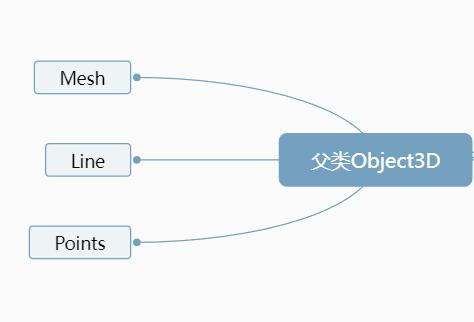

**点模型 Points、线模型 Line、网格网格模型 Mesh 等模型对象的父类都是 Object3D (opens new window),如果想对这些模型进行旋转、缩放、平移等操作,如何实现,可以查询 Threejs 文档 Object3D (opens new window)对相关属性和方法的介绍**



## 三维向量 Vector3

> 三维向量 Vector3 有 xyz 三个分量,threejs 中会用三维向量 Vector3 表示很多种数据,本节课提到的比较简单,就是位置.position 和缩放.scale 属性.

> 查看 three.js 文档你可以知道 Vector3 对象具有属性.x、.y、.z,Vector3 对象还具有.set()等方法.

```js
//new THREE.Vector3()实例化一个三维向量对象
const v3 = new THREE.Vector3(0, 0, 0);
console.log('v3', v3);
v3.set(10, 0, 0); //set方法设置向量的值
v3.x = 100; //访问x、y或z属性改变某个分量的值
```

## 位置属性.position

```js
// 位置属性.position使用threejs三维向量对象Vector3表示的
console.log('模型位置属性.position的值', mesh.position);
```

> 模型位置.position 属性用一个三维向量表示,那意味着,以后你想改变位置属性,就应该查询文档 Vector3.

## 改变位置属性

> 通过模型位置属性.position 可以设置模型在场景 Scene 中的位置,模型位置.position 的默认值是 THREE.Vector3(0.0,0.0,0.0),表示坐标原点.

**设置网格模型 y 坐标**

```js
mesh.position.y = 80;
```

**设置模型 xyz 坐标**

```js
mesh.position.set(80, 2, 10);
```

## 平移

> 执行.translateX()、.translateY()等方法本质上改变的都是模型的位置属性.position

> 网格模型沿着 x 轴正方向平移 100,可以多次执行该语句,每次执行都是相对上一次的位置进行平移变换.

```js
// 等价于mesh.position = mesh.position + 100;
mesh.translateX(100); //沿着x轴正方向平移距离100
```

**沿着 Z 轴负方向平移距离 50。**

```js
mesh.translateZ(-50);
```

**沿着自定义的方向移动**

```js
//向量Vector3对象表示方向
const axis = new THREE.Vector3(1, 1, 1);
axis.normalize(); //向量归一化
//沿着axis轴表示方向平移100
mesh.translateOnAxis(axis, 100);
```

## 缩放

> 属性.scale 表示模型对象的 xyz 三个方向上的缩放比例,.scale 的属性值是一个三维向量对象 Vector3,默认值是 THREE.Vector3(1.0,1.0,1.0)

**x 轴方向放大 2 倍**

```js
mesh.scale.x = 2.0;
```

**网格模型 xyz 方向分别缩放 0.5,1.5,2 倍**

```js
mesh.scale.set(0.5, 1.5, 2);
```
