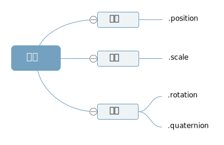

**模型的角度属性.rotation 和四元数属性.quaternion 都是表示模型的角度状态,只是表示方法不同，.rotation 属性值是欧拉对象 Euler (opens new window),.quaternion 属性值是是四元数对象 Quaternion**



## 欧拉对象 Euler

```js
// 创建一个欧拉对象，表示绕着xyz轴分别旋转45度，0度，90度
const Euler = new THREE.Euler(Math.PI / 4, 0, Math.PI / 2);
```

> 通过属性设置欧拉对象的三个分量值

```js
const Euler = new THREE.Euler();
Euler.x = Math.PI / 4;
Euler.y = Math.PI / 2;
Euler.z = Math.PI / 4;
```

## 改变角度属性.rotation

> 角度属性.rotation 的值是欧拉对象 Euler,意味着你想改变属性.rotation,可以查询文档关于 Euler 类的介绍

```js
//绕y轴的角度设置为60度
mesh.rotation.y += Math.PI / 3;
//绕y轴的角度增加60度
mesh.rotation.y += Math.PI / 3;
//绕y轴的角度减去60度
mesh.rotation.y -= Math.PI / 3;
```

## 旋转方法.rotateX()、.rotateY()、.rotateZ()

> 型执行.rotateX()、.rotateY()等旋转方法,你会发现改变了模型的角度属性.rotation

```js
mesh.rotateX(Math.PI / 4); //绕x轴旋转π/4
```

```js
// 绕着Y轴旋转90度
mesh.rotateY(Math.PI / 2);
//控制台查看：旋转方法，改变了rotation属性
console.log(mesh.rotation);
```

## 绕某个轴旋转

> 网格模型绕(0,1,0)向量表示的轴旋转 π/8

```js
const axis = new THREE.Vector3(0, 1, 0); //向量axis
mesh.rotateOnAxis(axis, Math.PI / 8); //绕axis轴旋转π/8
```

## 旋转动画

```js
// 渲染循环
function render() {
  model.rotation.y += 0.01;
  requestAnimationFrame(render);
}
```

```js
function render() {
  model.rotateY(0.01);
}
```
