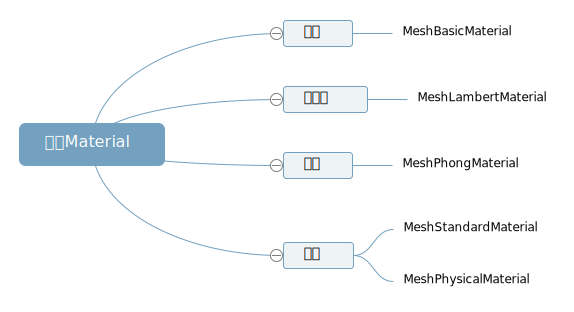

## 材质父类 Material

> 查询 threejs 文档,你可以看到基础网格材质 MeshBasicMaterial、漫反射网格材质 MeshLambertMaterial、高光网格材质 MeshPhongMaterial 等网格材质都有一个共同的父类 Material



## 网格材质继承父类属性

> 从 JavaScript 语法角度看子类都会继承父类的属性和方法,threejs 的材质同样道理

> MeshBasicMaterial、MeshLambertMaterial、MeshPhongMaterial 等子类网格材质会从父类 Material 继承一些属性和方法,比如透明度属性.opacity、面属性.side、是否透明属性.transparent 等等

## 材质半透明设置

```js
material.transparent = true; //开启透明
material.opacity = 0.5; //设置透明度
```

## 材质面属性.side

> 你可以用矩形平面 PlaneGeometry 来测试材质的面属性.side

> 查看文档，可以知道材质面属性.side 默认值是 THREE.FrontSide,表示网格模型正面可以看到，THREE.BackSide 表示背面可以看到，THREE.DoubleSide 表示双面可以看到

```js
material.side = THREE.BackSide; //背面可以看到
material.side = THREE.DoubleSide; //双面可见
```

> THREE.FrontSide、THREE.BackSide、THREE.DoubleSide 其实在 theeejs 内部都表示一个数字,你可以通过浏览器控制 log 打印查看验证,具体可以查看 src 目录下 constants.js 的源码文件.

```js
console.log('material.side', material.side);
```
