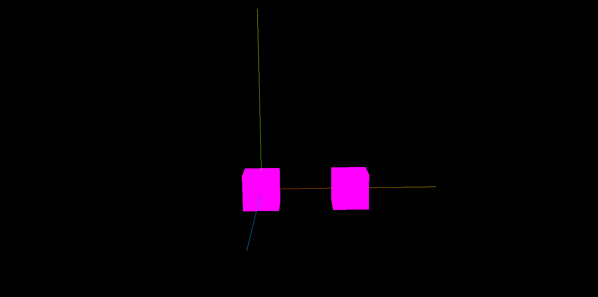
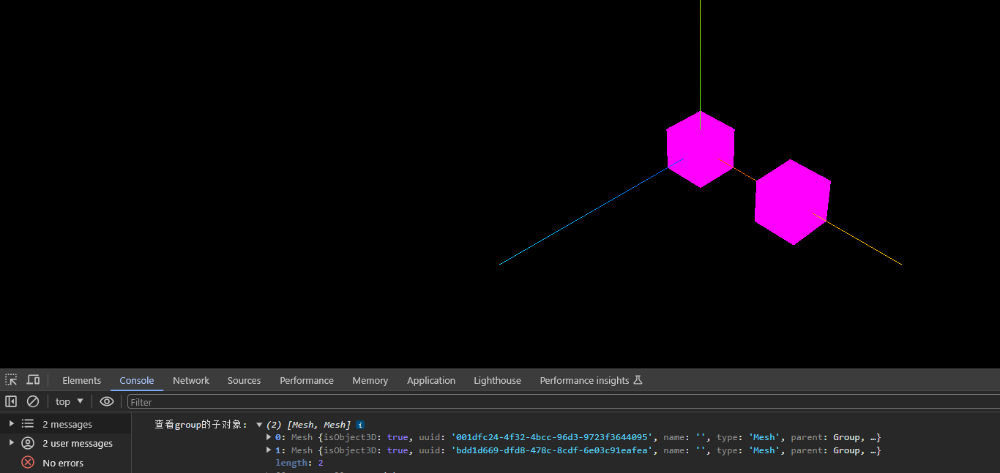
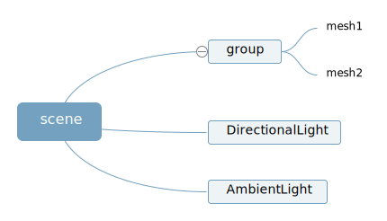
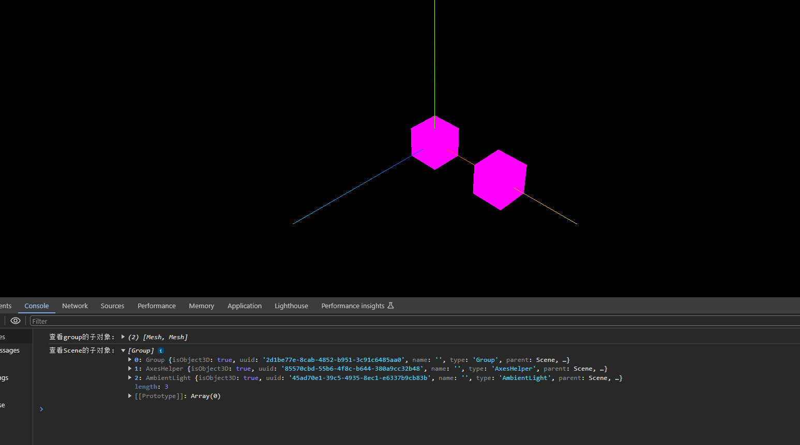
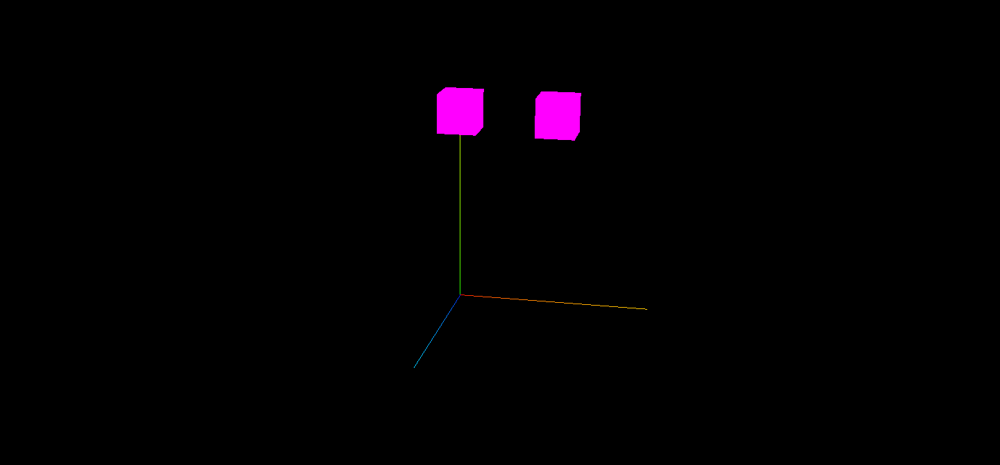
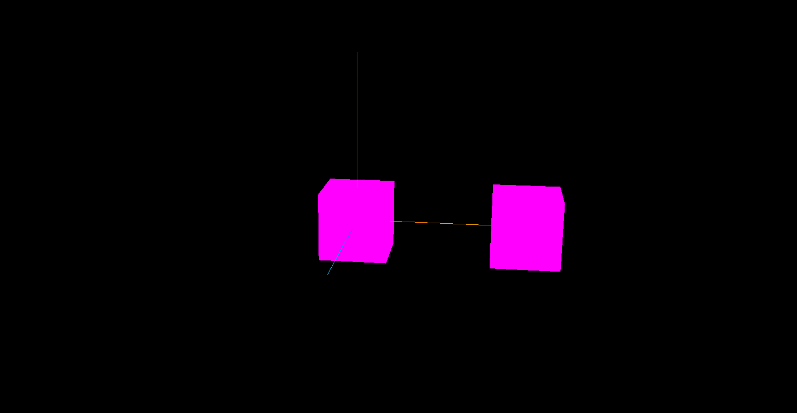
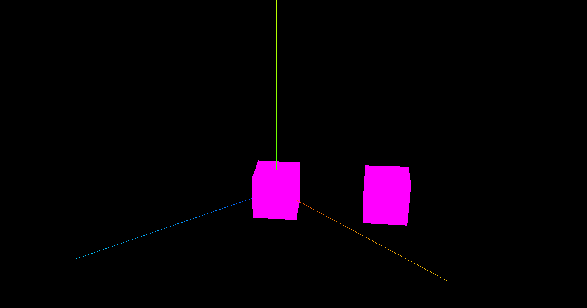
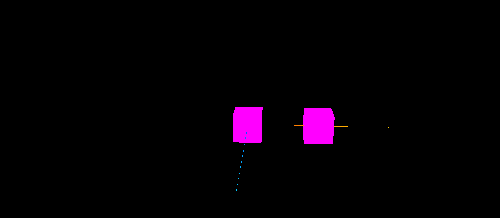

## Group 层级模型(树结构)案例


> 下面代码创建了两个网格模型, mesh1 和 mesh2,通过 THREE.Group 类创建了一个组对象 group,然后通过 add 方法将网格模型 mesh1 和 mesh2 设置为 group 的子对象,然后再通过执行 scene.add(group)将组对象 group 作为场景对象的 scene 的子对象,也就是说 scene 是 group 的父对象,group 是 mesh1 和 mesh2 的父对象,这样就构成了一个三层的层级结构,当然也可以通过 Group 自己创建新模型节点作为层级结构中的一层

```js
//创建两个网格模型mesh1、mesh2
const geometry = new THREE.BoxGeometry(20, 20, 20);
const material = new THREE.MeshLambertMaterial({ color: 0x00ffff });
const group = new THREE.Group();
const mesh1 = new THREE.Mesh(geometry, material);
const mesh2 = new THREE.Mesh(geometry, material);
mesh2.translateX(25);
//把mesh1型插入到组group中，mesh1作为group的子对象
group.add(mesh1);
//把mesh2型插入到组group中，mesh2作为group的子对象
group.add(mesh2);
//把group插入到场景中作为场景子对象
scene.add(group);
```



## 查看子对象.children

> threejs 的场景对象 Scene,组对象 Group 都有一个子对象属性.children,通过该属性可以访问到父对象中的子对象,子对象.children 的值是数组,所有子对象是数组的值

> 父对象执行.add 方法的本质就是把参数中的子对象添加到自身的子对象属性.children 中

```js
console.log('查看group的子对象', group.children);
```



## 场景对象结构

```js
console.log('查看scene的子对象:', scene.children);
```



> 场景对象 Scene 中的子对象,除了 Group 之外,还可以看到环境光 AmbientLight, 平行光 DirectionalLight, 辅助坐标对象 AxesHelper

> 场景对象 scene 构成的层级模型本身就是一个树形结构,场景对象层级模型的第一层,也就是树结构的根节点,一般来说网格模型 mesh,点模型 points,线模型 line 是树结构的最外层叶子节点,构建层级模型的中间层一般都是通过 threejs 的 Group 来完成的,Group 类实例化的对象可以成为组对象
> 

## .add()方法总结

> 场景对象 Scene、组对象 Group 的.add()方法都是继承自它们共同的基类(父类)Object3D

```js
group.add(mesh1);
group.add(mesh2);
```

> .add()方法可以单独插入一个对象，也可以同时插入多个子对象

```js
group.add(mesh1, mesh2);
```

## 父对象旋转缩放平移变换,子对象跟着变化

> 网格模型 mesh1、mesh2 作为设置为父对象 group 的子对象,如果父对象 group 进行旋转、缩放、平移变换，子对象同样跟着变换，就像你的头旋转了，眼睛会跟着头旋转

```js
//沿着Y轴平移mesh1和mesh2的父对象，mesh1和mesh2跟着平移
group.translateY(100);
```



```js
//父对象缩放，子对象跟着缩放
group.scale.set(4, 4, 4);
```



```js
//父对象旋转，子对象跟着旋转
group.rotateY(Math.PI / 6);
```



## Object3D 表示模型对象节点

> 受 threejs 历史影响,你会在很多别的代码中看到 Object3D 作为 Group 来使用,如果看到不用奇怪,某种程度上,你可把两者画等号,只是 Group 更加语义化,Object3D 本身就是表示模型节点的意思

```js
const mesh1 = new THREE.Mesh(geometry, material);
const mesh2 = new THREE.Mesh(geometry, material);
const obj = new THREE.Object3D(); //作为mesh1和mesh2的父对象
obj.add(mesh1, mesh2);
```



## mesh 也能添加 mesh 子对象

> threejs 默认 mesh 也可以添加子对象,其实原因很简单,mesh 和 Group 父类都是 Object3D,本质上也可以认为都是 Object3D

```js
//threejs默认mesh也可以添加子对象,mesh基类也是Object3D
mesh1.add(mesh2);
```


