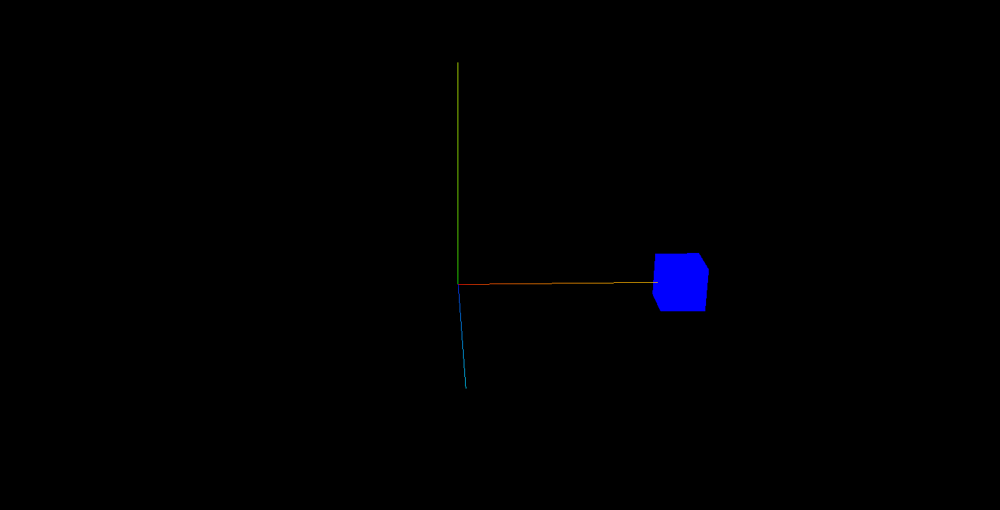

## 本地(局部)坐标和世界坐标

```js
// mesh的世界坐标就是mesh.position与group.position的累加
const mesh = new THREE.Mesh(geometry, material);
mesh.position.set(50, 0, 0);
const group = new THREE.Group();
group.add(mesh);
group.position.set(50, 0, 0);
```

1. 改变子对象的.position,子对象在 3D 空间中的坐标会发生改变
2. 改变父对象的.position,子对象在 3D 空间中的位置也会跟着变化,也就是说父对象.position 和子对象.position 叠加才是才是子对象的.position

**任何一个模型的本地坐标(局部坐标)就是模型的.position 属性**
**一个模型的世界坐标,说的是,模型自身.position 和所有父对象.position 累加的坐标**



## .getWorldPosition()获取世界坐标

> mesh.getWorldPosition(Vector3)可以读取一个模型的世界坐标,并把读取结果存储到参数 Vector3 中

```js
// 声明一个三维向量用来表示某个坐标
const worldPosition = new THREE.Vector3();
// 获取mesh的世界坐标，你会发现mesh的世界坐标受到父对象group的.position影响
mesh.getWorldPosition(worldPosition);
console.log(worldPosition); // x: 100, y: 0, z: 0
console.log('世界坐标', worldPosition); // x: 100, y: 0, z: 0
console.log('本地坐标', mesh.position); // x: 50, y: 0, z: 0
```

## 给子对象添加一个局部坐标系

> mesh.add(坐标系)给 mesh 添加一个局部坐标系

```js
//可视化mesh的局部坐标系
const meshAxesHelper = new THREE.AxesHelper(50);
mesh.add(meshAxesHelper);
```
