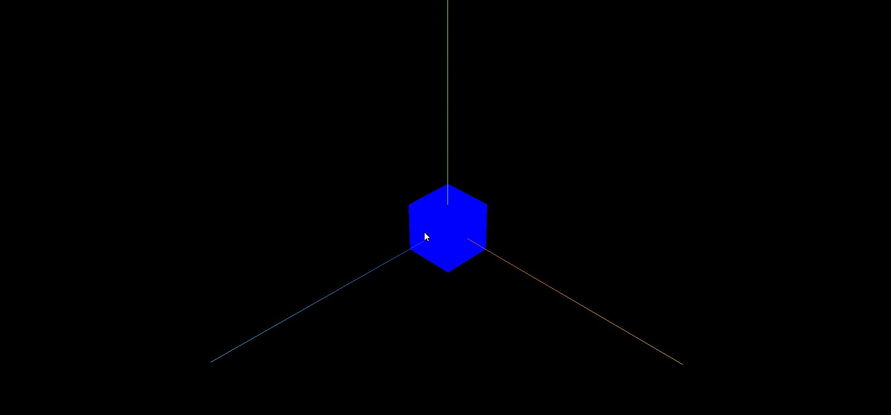
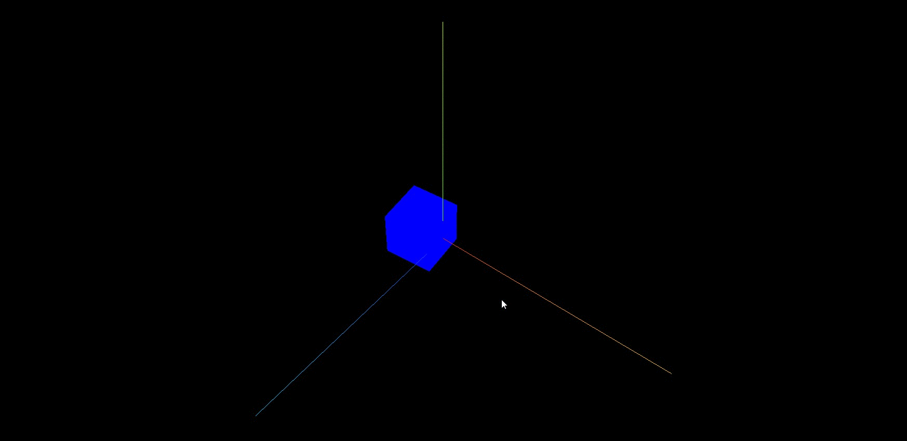

**通过改变几何体顶点坐标,可以改变模型自身相对坐标原点的位置**

```js
//长方体的几何中心默认与本地坐标原点(0,0,0)重合
const geometry = new THREE.BoxGeometry(50, 50, 50);
```

```js
// 平移几何体的顶点坐标,改变几何体自身相对局部坐标原点的位置
geometry.translate(50 / 2, 0, 0);
```

## 旋转测试

> 局部坐标相对模型发生改变,旋转轴自然也会发生变化

> .rotateY()默认绕几何体中心旋转,经过上面几何体平移变化,你会发现.rotateY()是绕长方体面上一条线旋转

> 你可以设置旋转动画,观察几何体平移前后旋转动画差异

```js
function render() {
  model.rotateY(0.01); //旋转动画
  requestAnimationFrame(render);
}
render();
```

## 改变前效果



## 改变后效果


