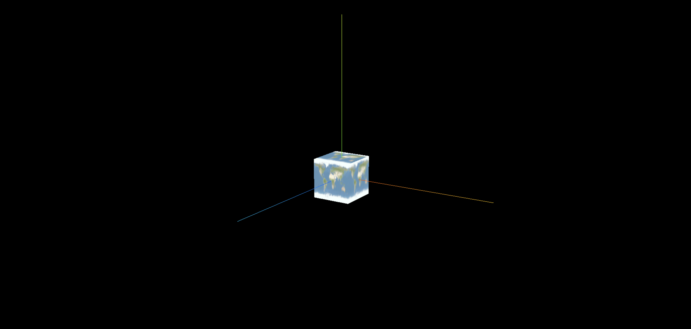
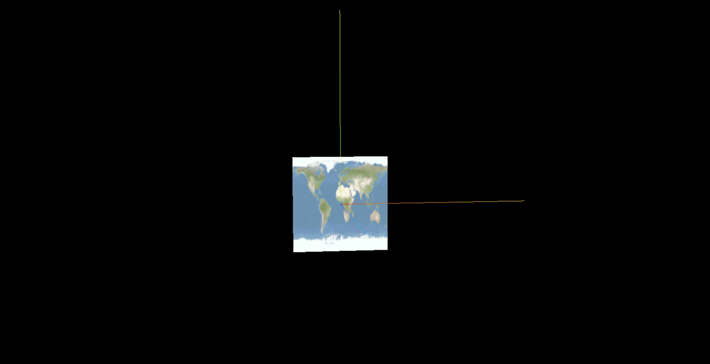

## 创建纹理贴图

> 通过纹理贴图加载器 TextureLoader 的 load()方法加载一张图片可以返回一个纹理对象 Texture,这个纹理对象可以作为模型材质颜色贴图的 map 属性的值

```js
const geometry = new THREE.PlaneGeometry(200, 100);
//纹理贴图加载器TextureLoader
const texLoader = new THREE.TextureLoader();
// .load()方法加载图像，返回一个纹理对象Texture
const texture = texLoader.load('./earth.jpg');
const material = new THREE.MeshLambertMaterial({
  // 设置纹理贴图：Texture对象作为材质map属性的属性值
  map: texture, //map表示材质的颜色贴图属性
});
```

## 颜色贴图属性: map

> 也可以通过颜色贴图属性.map 直接设置纹理贴图,和材质的参数设置一样

```js
material.map = texture;
```

## 颜色贴图和 color 属性颜色值会混合

> 设置了材质的颜色贴图属性 map 后,模型会从纹理贴图上采集像素值,这时候一般来说不需要再设置材质颜色 color

> map 贴图之所以称之为颜色贴图就是因为网格模型会获得颜色贴图的颜色值 RGB

> 总结: 颜色贴图 map 和 color 属性值会混合,如果没有特殊需要,设置了颜色贴图后,就不要再设置 color 的值,color 默认为白色 0xffffff

```js
const material = new THREE.MeshLambertMaterial({
  // color: 0x00ffff,
  // 设置纹理贴图：Texture对象作为材质map属性的属性值
  map: texture, //map表示材质的颜色贴图属性
});
```

## 完整代码

```js
import * as THREE from 'three';
import { OrbitControls } from 'three/addons/controls/OrbitControls.js';

const scene = new THREE.Scene();

// 1.创建纹理加载器对象
const textureLoader = new THREE.TextureLoader();

// 2.使用load方法加载图片, 会返回一个纹理对象
const texture = textureLoader.load('./earth.jpg');

// const geometry = new THREE.BoxGeometry(50, 50, 50);
const geometry = new THREE.PlaneGeometry(100, 100, 100);
const material = new THREE.MeshBasicMaterial({
  // color: 0xff0000, // 纹理贴图最好不要搭配color一起设置, 会影响
  map: texture, // 3.设置材质的颜色贴图, 将纹理对象(图片)作为mesh材质的贴图
});
const mesh = new THREE.Mesh(geometry, material);
scene.add(mesh);

const ambientLight = new THREE.AmbientLight(0xffffff, 1);
scene.add(ambientLight);

const camera = new THREE.PerspectiveCamera(
  30,
  window.innerWidth / window.innerHeight,
  0.1,
  1000
);
camera.position.set(500, 500, 500);

const renderer = new THREE.WebGLRenderer();
renderer.setSize(window.innerWidth, window.innerHeight);

const render = () => {
  renderer.render(scene, camera);
  window.requestAnimationFrame(render);
};

render();

new OrbitControls(camera, renderer.domElement);

const axesHelper = new THREE.AxesHelper(200);
scene.add(axesHelper);

document.body.appendChild(renderer.domElement);

window.onresize = () => {
  renderer.setSize(window.innerWidth, window.innerHeight);
  camera.aspect = window.innerWidth / window.innerHeight;
  camera.updateProjectionMatrix();
};
```

## 测试不同几何体添加纹理贴图的效果

> 可以尝试把颜色纹理贴图映射到不同的几何体上查看渲染效果,至于为什么映射的结果不同,其实和 UV 坐标有关

**BoxGeometry**


**SphereGeometry**


**PlaneGeometry**

