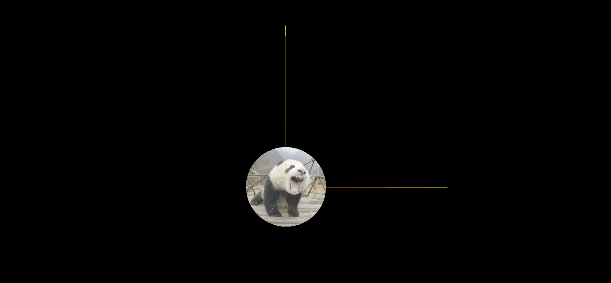

## 圆形平面设置纹理贴图

> 思考: 如何实现一个是矩形形状的图片,裁剪为圆形渲染?

> 其实很简单,可以通过圆形几何体 CircleGeometry 创建一个网格模型 Mesh,把一张图片作为圆形 Mesh 材质的颜色贴图,这样就可以将一张方形图片裁剪渲染为圆形效果

```js
//CircleGeometry的顶点UV坐标是按照圆形采样纹理贴图
const geometry = new THREE.CircleGeometry(60, 100);
//纹理贴图加载器TextureLoader
const texLoader = new THREE.TextureLoader();
const texture = texLoader.load('./texture.jpg');
const material = new THREE.MeshBasicMaterial({
  map: texture, //map表示材质的颜色贴图属性
  side: THREE.DoubleSide,
});
const mesh = new THREE.Mesh(geometry, material);
```

## 本质原理

> CircleGeometry 的 UV 坐标会对颜色纹理贴图 map 进行提取,CircleGeometry 的 UV 坐标默认提取的就是一个圆形轮廓

## 完整代码

```js
import * as THREE from 'three';
import { OrbitControls } from 'three/addons/controls/OrbitControls.js';

const scene = new THREE.Scene();

// 1.创建纹理加载器对象
const textureLoader = new THREE.TextureLoader();

// 2.使用load方法加载图片, 会返回一个纹理对象
const texture = textureLoader.load('./texture.jpg');

// const geometry = new THREE.BoxGeometry(50, 50, 50);
const geometry = new THREE.CircleGeometry(50, 1000);
const material = new THREE.MeshBasicMaterial({
  // color: 0xff0000, // 纹理贴图最好不要搭配color一起设置, 会影响
  map: texture, // 3.设置材质的颜色贴图, 将纹理对象(图片)作为mesh材质的贴图
  side: THREE.DoubleSide,
});
const mesh = new THREE.Mesh(geometry, material);
scene.add(mesh);

const ambientLight = new THREE.AmbientLight(0xffffff, 1);
scene.add(ambientLight);

const camera = new THREE.PerspectiveCamera(
  30,
  window.innerWidth / window.innerHeight,
  0.1,
  1000
);
camera.position.set(500, 500, 500);

const renderer = new THREE.WebGLRenderer();
renderer.setSize(window.innerWidth, window.innerHeight);

const render = () => {
  renderer.render(scene, camera);
  window.requestAnimationFrame(render);
};

render();

new OrbitControls(camera, renderer.domElement);

const axesHelper = new THREE.AxesHelper(200);
scene.add(axesHelper);

document.body.appendChild(renderer.domElement);

window.onresize = () => {
  renderer.setSize(window.innerWidth, window.innerHeight);
  camera.aspect = window.innerWidth / window.innerHeight;
  camera.updateProjectionMatrix();
};
```

## 效果


