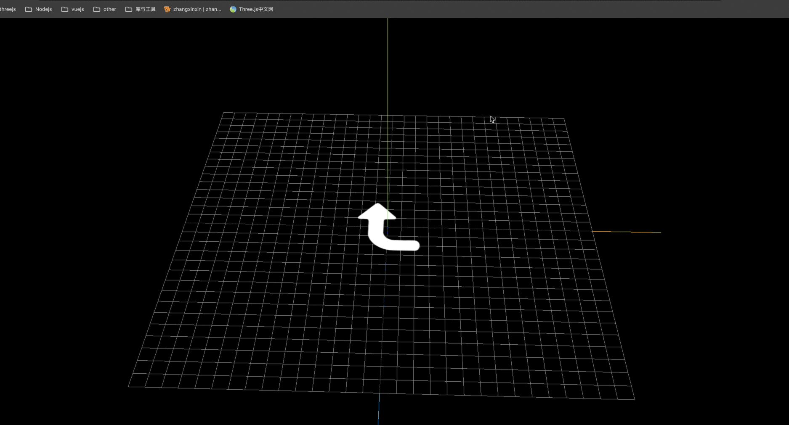

## 矩形 Mesh+背景透明 png 贴图

> threejs 项目开发中,将一个背景透明的.png 图像作为平面矩形网格模型 Mesh 的颜色贴图是一个非常有用的功能,通过这样一个功能,可以对 threejs 三维场景进行标注

> 整体思路: 创建一个矩形平面,设置颜色贴图,注意: 如果选择了背景透明的 png 图像作为颜色贴图的话,需要设置材质的 transparent 为 true,这样 png 图片的透明部分就不会被显示

```js
const geometry = new THREE.PlaneGeometry(60, 60); // 默认在XOY平面上
const textureLoader = new THREE.TextureLoader();
const texture = textureLoader.load('图片路径');

const material = new THREE.MeshBasicMaterial({
  map: texture,
  transparent: true, // 使用背景透明的png贴图，注意开启透明计算
});

const mesh = new THREE.Mesh(geometry, material);
mesh.rotateX(-Math.PI / 2);
```

## 网格地面辅助观察 GridHelper

```js
// 添加一个辅助网格地面
const gridHelper = new THREE.GridHelper(300, 25, 0x004444, 0x004444);
```

## 矩形平面 PlaneGeometry 设置颜色贴图

```js
const geometry = new THREE.PlaneGeometry(60, 60);
const textureLoader = new THREE.TextureLoader();
const material = new THREE.MeshBasicMaterial({
  map: textureLoader.load('./指南针.png'),
});
const mesh = new THREE.Mesh(geometry, material);
```

## 开启透明 transparent: true

```js
const material = new THREE.MeshBasicMaterial({
  map: textureLoader.load('./指南针.png'),
  //transparent: true：使用背景透明的png贴图，注意允许透明
  transparent: true,
});
```

## 旋转平移矩形平面

> PlaneGeometry 矩形平面默认是在 XOY 平面上,如果你想平行 XOZ 平面,就需要手动设置旋转实现

```js
mesh.rotateX(-Math.PI / 2); // 平行地面: 矩形Mesh默认单面可见
```

> 如果你不想矩形平面 Mesh 与地面网格线重合,可以通过位置属性.position 偏移

```js
mesh.position.y = 1; //适当偏移，不与地面重合
```

## 完整代码

```js
import * as THREE from 'three';
import { OrbitControls } from 'three/addons/controls/OrbitControls.js';

const scene = new THREE.Scene();

const textureLoader = new THREE.TextureLoader();
const texture = textureLoader.load('./转弯.png');
const geometry = new THREE.PlaneGeometry(60, 60);
const material = new THREE.MeshBasicMaterial({
  map: texture,
  transparent: true,
});
const mesh = new THREE.Mesh(geometry, material);
scene.add(mesh);
mesh.rotateX(-Math.PI / 2);
mesh.position.y = 1;

const ambientLight = new THREE.AmbientLight(0xffffff, 1);
scene.add(ambientLight);

const camera = new THREE.PerspectiveCamera(
  30,
  window.innerWidth / window.innerHeight,
  1,
  3000
);
camera.position.set(292, 223, 185);
camera.lookAt(0, 0, 0);

const renderer = new THREE.WebGLRenderer();
renderer.setSize(window.innerWidth, window.innerHeight);

const render = () => {
  renderer.render(scene, camera);
  window.requestAnimationFrame(render);
};

render();

new OrbitControls(camera, renderer.domElement);

const axesHelper = new THREE.AxesHelper(200);
scene.add(axesHelper);

const gridHelper = new THREE.GridHelper(300, 30);
scene.add(gridHelper);

document.body.appendChild(renderer.domElement);

window.onresize = () => {
  renderer.setSize(window.innerWidth, window.innerHeight);
  camera.aspect = window.innerWidth / window.innerHeight;
  camera.updateProjectionMatrix();
};
```

## 效果


