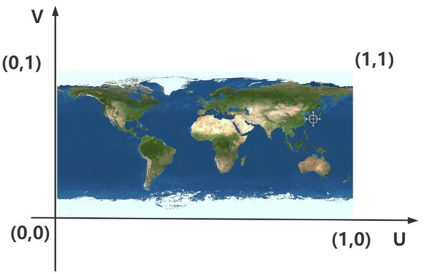

## UV 动画

> 通过纹理对象的偏移属性 offset 可以实现 uv 动画效果

## 纹理对象 offset 属性

> 纹理对象 Texture 的 offset 功能是偏移贴图在 Mesh 上的位置,本质上相当于修改了 uv 顶点的坐标

```js
texture.offset.x += 0.5; // 纹理方向U方向偏移
```

```js
texture.offset.y += 0.5; // 纹理方向V方向偏移
```



## 纹理坐标 wrapS 或 wrapT 与 offset 组合使用

> 你可以对比, 当通过 offset 设置了纹理映射偏移后,是否把 wrapS 或 wrapT 设置为重复映射模式 THREE.RepeatWrapping,两种情况的渲染效果是会有差异的

```js
texture.offset.x += 0.5; // 设置纹理方向U方向偏移

// 设置wrapS也就是U方向,纹理映射模式(包裹模式)
texture.wrapS = THREE.RepeatWrapping; // 对应offset.x偏移
```

```js
texture.offset.y += 0.5; //纹理V方向偏移

// 设置.wrapT也就是V方向，纹理映射模式
texture.wrapT = THREE.RepeatWrapping; //对应offste.y偏移
```

## 实现纹理 UV 动画

> 纹理对象 Texture 的.offset 的功能是偏移贴图在 Mesh 上位置

```js
// 渲染循环
function render() {
  texture.offset.x += 0.001; //设置纹理动画：偏移量根据纹理和动画需要, 设置合适的值
  renderer.render(scene, camera);
  requestAnimationFrame(render);
}
render();
```

## 纹理贴图阵列 + UV 动画

> 通过阵列纹理贴图设置.map,这样的话贴图像素可以更小一些

```js
// 设置U方向阵列模式
texture.wrapS = THREE.RepeatWrapping;

// 设置uv两个方向纹理贴图的重复数量
texture.repeat.x = 50; // 注意选择合适的阵列数量
```

```js
// 渲染循环
// 渲染循环
function render() {
  texture.offset.x += 0.1; //设置纹理动画：偏移量根据纹理和动画需要，设置合适的值
  renderer.render(scene, camera);
  requestAnimationFrame(render);
}
render();
```

## 完整代码

```js
import * as THREE from 'three';
import { OrbitControls } from 'three/addons/controls/OrbitControls.js';

const scene = new THREE.Scene();

// 1.创建纹理加载器对象
const textureLoader = new THREE.TextureLoader();

// 2.使用load方法加载图片, 会返回一个纹理对象
const texture = textureLoader.load('./纹理3.jpg');
// 设置.wrapS也就是U方向，纹理映射模式(包裹模式)
texture.wrapS = THREE.RepeatWrapping;
// 设置.wrapT也就是V方向，纹理映射模式
texture.wrapS = THREE.RepeatWrapping; // 对应offste.y偏移

// 设置uv两个方向纹理重复数量
texture.repeat.x = 50; //注意选择合适的阵列数量

const geometry = new THREE.PlaneGeometry(200, 30);
const material = new THREE.MeshBasicMaterial({
  map: texture, // 3.设置材质的颜色贴图, 将纹理对象(图片)作为mesh材质的贴图
  transparent: true,
});
const mesh = new THREE.Mesh(geometry, material);
scene.add(mesh);
mesh.rotateX(-Math.PI / 2);
mesh.position.y = 1;

const ambientLight = new THREE.AmbientLight(0xffffff, 1);
scene.add(ambientLight);

const camera = new THREE.PerspectiveCamera(
  30,
  window.innerWidth / window.innerHeight,
  1,
  3000
);
camera.position.set(292, 223, 185);
camera.lookAt(0, 0, 0);

const renderer = new THREE.WebGLRenderer();
renderer.setSize(window.innerWidth, window.innerHeight);

const render = () => {
  //纹理U方向偏移
  texture.offset.x += 0.1; // 设置纹理动画：偏移量根据纹理和动画需要,设置合适的值
  renderer.render(scene, camera);
  window.requestAnimationFrame(render);
};

render();

new OrbitControls(camera, renderer.domElement);

const axesHelper = new THREE.AxesHelper(200);
scene.add(axesHelper);

const gridHelper = new THREE.GridHelper(300, 30);
scene.add(gridHelper);

document.body.appendChild(renderer.domElement);

window.onresize = () => {
  renderer.setSize(window.innerWidth, window.innerHeight);
  camera.aspect = window.innerWidth / window.innerHeight;
  camera.updateProjectionMatrix();
};
```

## 效果


