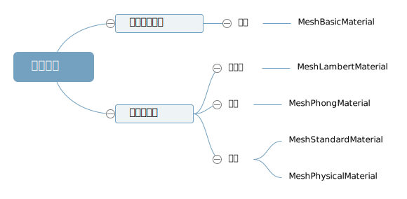

## 递归遍历层级模型并修改材质

> 加载一个外部模型,比如 gltf 模型,如果你想批量修改每个 Mesh 的材质,一个一个设置比较麻烦,可以通过递归遍历方法.traverse()批量操作更加方便

## 递归遍历方法.traverse()

> 递归遍历 gltf 所有的模型节点

```js
// 递归遍历所有模型节点批量修改材质
gltf.scene.traverse(function (obj) {
  if (obj.isMesh) {
    //判断是否是网格模型
    console.log('模型节点', obj);
    console.log('模型节点名字', obj.name);
  }
});
```

## 查看 gltf 默认的材质

> .obj、.gltf、.fbx 等不同格式的模型,threejs 加载默认的材质可能不同,不过也不用刻意记忆,通过浏览器控制台 log 打印即可 console.log(obj.material)



> threejs 解析 gltf 模型默认材质一般是 MeshStandardMaterial 或 MeshPhysicalMaterial,相比较其它网格材质,这两个材质属于 PBR 物理材质,可以提供更加真实的材质效果

```js
// 递归遍历所有模型节点批量修改材质
gltf.scene.traverse(function (obj) {
  if (obj.isMesh) {
    console.log('gltf默认材质', obj.material);
  }
});
```

## 批量修改 gltf 所有 Mesh 的材质

```js
gltf.scene.traverse(function (obj) {
  if (obj.isMesh) {
    // 重新设置材质
    obj.material = new THREE.MeshLambertMaterial({
      color: 0xffffff,
    });
  }
});
```


