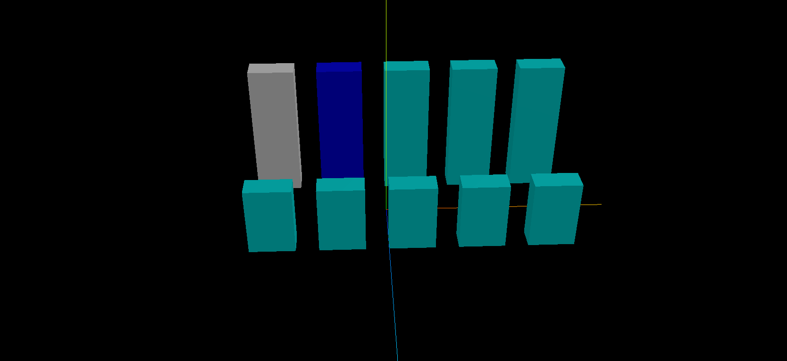

**美术通过三维建模软件,比如使用 Blender 绘制好一个三维场景以后,一些外观一样的 Mesh,可能会共享一个材质对象**

## 改变一个模型颜色其它模型跟着变化

> 由于楼房的 Mesh 共享了 1 号楼 Mesh 的材质,当你通过 mesh1.material 改变 mesh1 材质,本质上是改变所有楼 Mesh 的材质

```js
const mesh1 = gltf.scene.getObjectByName('1号楼');
//1. 改变1号楼Mesh材质颜色
mesh1.material.color.set(0xff0000);
```

## 使用.name 标记材质，判断两个 mesh 是否共享材质

> 通过.name 标记材质,测试 mesh1 和 mesh2 是否共享了材质

```js
const mesh1 = gltf.scene.getObjectByName('1号楼');
mesh1.material.name = '楼房材质'; //通过name标记mesh1对应材质
const mesh2 = gltf.scene.getObjectByName('2号楼');
//通过name相同，可以判断mesh1.material和mesh2.material共享了同一个材质对象
console.log('mesh2.material.name', mesh2.material.name);
```

## 解决问题方向

> 改变一个模型颜色其它模型跟着变化,是因为多个模型对象共享了材质,如果单独改变一个模型的材质,比如颜色,下面两个方案,可以任选其一

1. 三维建模软件中设置,需要代码改变材质的 Mesh 不要共享材质,要独享材质
2. 代码批量更改：克隆材质对象,重新赋值给 mesh 的材质属性

## 代码方式解决多个 mesh 共享材质的问题

```js
//用代码方式解决mesh共享材质问题
gltf.scene.getObjectByName('小区房子').traverse(function (obj) {
  if (obj.isMesh) {
    // 通过.material.clone()返回一个新材质对象,和原来一样,重新赋值给.material属性
    obj.material = obj.material.clone();
  }
});
mesh1.material.color.set(0xffff00);
mesh2.material.color.set(0x00ff00);
```

## 效果



## 完整代码

```js
import * as THREE from 'three';
import { GLTFLoader } from 'three/addons/loaders/GLTFLoader.js';

const group = new THREE.Group();

// 1.实例化一个加载器
const loader = new GLTFLoader();

// 2.加载gltf模型
loader.load('./简易小区-共享材质.glb', (gltf) => {
  console.log(gltf);
  // const mesh1 = gltf.scene.getObjectByName('1号楼');
  // mesh1.material.name = '1号楼材质';

  // const mesh2 = gltf.scene.getObjectByName('2号楼');

  // 1.改变1号楼Mesh材质颜色, 其他楼颜色也全部会变红
  // mesh1.material.color.set(0xff0000);

  //2.通过name相同，可以判断mesh1.material和mesh2.material共享了同一个材质对象
  // console.log('mesh1', mesh1.material.name); // 1号楼材质
  // console.log('mesh2', mesh2.material.name); // 1号楼材质
  group.add(gltf.scene);

  // 用代码方式解决mesh共享材质问题
  gltf.scene.getObjectByName('小区房子').traverse((obj) => {
    if (obj.isMesh) {
      console.log(obj);
      obj.material = obj.material.clone();
    }
  });

  gltf.scene.getObjectByName('1号楼').material.color.set(0xffffff);
  gltf.scene.getObjectByName('2号楼').material.color.set(0x0000ff);
});

export default group;
```
