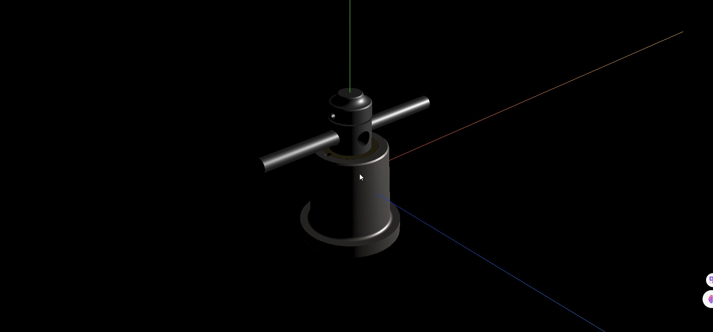
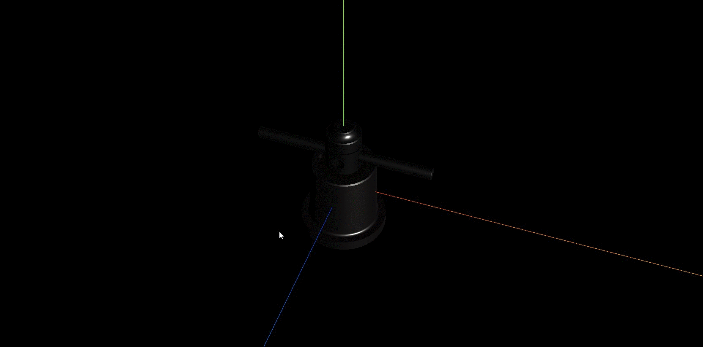

## PBR 材质金属度和粗糙度

**此文章介绍下 PBR 材质的金属度与粗糙度**

## 金属度 metalness

> 金属度属性表示材质像金属的程度,非金属材料,如木板或石材使用 0.0,金属使用 1.0

> threejs 的 PBR 材质金属度默认是 0.5

> 0.0~1.0 之间的值可用于生锈的金属外观

```js
new THREE.MeshStandardMaterial({
  metalness: 1.0, //金属度属性
});
```

```js
mesh.material.metalness = 1.0; //金属度
```

## 效果



## 粗糙度 roughness

> 生活中不同物体表面的粗糙度程度会有不同,比如地面比较粗糙,比如镜子表面比较光滑等等

> 粗糙度表示模型表面的光滑度或者说粗糙度,越光滑表示反射能力越强,越粗糙表示反射能力越弱

> 粗糙度 0.0 表示平滑的镜面反射,1.0 表示完全漫反射,默认值是 0.5

```js
new THREE.MeshStandardMaterial({
  roughness: 0.5, //表面粗糙度
});
```

```js
mesh.material.roughness = 0.5; //表面粗糙度
```

## 效果



## 完整代码

```js
import * as THREE from 'three';
import { GLTFLoader } from 'three/addons/loaders/GLTFLoader.js';

const loader = new GLTFLoader(); // 创建GLTF加载器

const group = new THREE.Group(); // 声明一个组对象,用来添加加载成功的三维场景

loader.load('../金属.glb', (gltf) => {
  // 递归遍历所有模型节点并批量修改材质
  gltf.scene.traverse((item) => {
    if (item.isMesh) {
      console.log(item.material);
      // 重新设置材质的金属度和粗糙度属性
      item.material.metalness = 1.0; //金属度
      item.material.roughness = 0.3; //表面粗糙度
    }
  });

  group.add(gltf.scene);
});

export default group;
```
