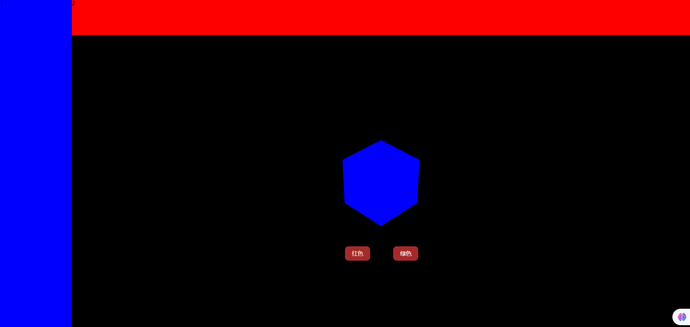

## UI 交互界面与 Canvas 画布叠加

**此文章把 threejs Cavnas 画布和 HTML 元素叠加布局时候,可能遇到问题演示下,以后遇到类似的问题知道怎么排查**

## 插入 div 元素

> 在.html 中插入一个 div 元素,你会看到地址元素影响 canvas 元素布局

```html
<div id="red">红色</div>

<style>
  #red {
    color: #fff;
  }
</style>
```

## canvas 画布绝对定位

> 如果你想设置 threejs Canvas 画布的 style 属性,可以通过 renderer.domElement 访问

```js
// canvas画布绝对定位
renderer.domElement.style.position = 'absolute';
renderer.domElement.style.top = '0px';
renderer.domElement.style.left = '0px';
```

> 这时候你会发现你插入的 div 元素就看不到了,这涉及到 z-index 的 CSS 布局知识点,具体说就是当两个 HTML 元素位置重合,谁在上谁在下的问题

## 设置 z-index

> 通过 z-index 改变 HTML 元素上下叠加关系

```js
renderer.domElement.style.zIndex = -1;
```

```html
<div id="red">红色</div>

<style>
  #red {
  z-index: 2,
  position: relative;
  color: #fff;
  }
</style>
```

> 注意默认的定位 position: static;设置 z-index 无效

## 插入的 div 元素绝对定位

> 不设置 three.js Canvas 元素 style,插入的 div 元素绝对定位,这样也可以把 div 元素叠加到 threejs Canvas 画布上

```html
<div id="red">红色</div>

<style>
  #red {
  z-index: 2,
  position: absolute;
  color: #fff;
  }
</style>
```

## 完整代码

> index.html

```html
<!DOCTYPE html>
<html lang="en">
  <head>
    <meta charset="UTF-8" />
    <meta name="viewport" content="width=device-width, initial-scale=1.0" />
    <title>Document</title>
  </head>
  <body>
    <div class="container">
      <div class="left">1</div>
      <div class="right">
        <div class="top">2</div>
        <div id="red">红色</div>
        <div id="green">绿色</div>
        <div class="bottom" id="three"></div>
      </div>
    </div>

    <script type="importmap">
      {
        "imports": {
          "three": "../../build/three.module.js",
          "three/addons/": "../../examples/jsm/"
        }
      }
    </script>

    <script src="./index.js" type="module"></script>
  </body>
</html>

<style>
  * {
    margin: 0;
    padding: 0;
    overflow: hidden;
  }

  .container {
    display: flex;
    height: 100vh;
  }

  .container .left {
    width: 200px;
    background-color: blue;
  }

  .container .right .top {
    width: calc(100vw - 200px);
    height: 100px;
    background-color: red;
  }

  .container .right .bottom {
    height: calc(100vh - 100px);
    background-color: gray;
    width: calc(100vw - 200px);
  }

  #red,
  #green {
    position: absolute;
    color: #fff;
    top: 75%;
    width: 50px;
    height: 30px;
    background-color: brown;
    text-align: center;
    line-height: 30px;
    border-radius: 10px;
    padding: 5px 10px;
    cursor: pointer;
  }

  #red {
    left: 50%;
  }

  #green {
    left: 57%;
  }
</style>
```

> index.js

```js
import * as THREE from 'three';
import Model from './model.js';
import { OrbitControls } from 'three/addons/controls/OrbitControls.js';

const width = window.innerWidth - 200;
const height = window.innerHeight - 100;

const scene = new THREE.Scene();
scene.add(Model);

const camera = new THREE.PerspectiveCamera(30, width / height, 0.1, 1000);
camera.position.set(300, 300, 300);

const renderer = new THREE.WebGLRenderer();
renderer.setSize(width, height);

const render = () => {
  renderer.render(scene, camera);
  window.requestAnimationFrame(render);
};

render();

new OrbitControls(camera, renderer.domElement);

document.getElementById('three').appendChild(renderer.domElement);

window.onresize = () => {
  const width = window.innerWidth - 200;
  const height = window.innerHeight - 100;
  renderer.setSize(width, height);
  camera.aspect = width / height;
  camera.updateProjectionMatrix();
};
```

> model.js

```js
import * as THREE from 'three';

const geometry = new THREE.BoxGeometry(50, 50, 50);
const material = new THREE.MeshBasicMaterial({
  color: 0x0000ff,
});

const mesh = new THREE.Mesh(geometry, material);

export default mesh;
```

## 效果


